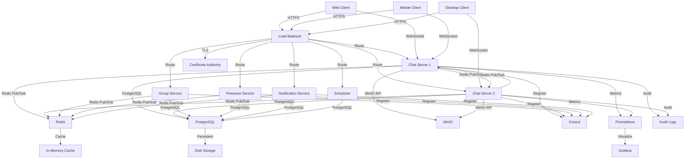

# SilentRelay Architecture Diagram

## Overview

This document provides a comprehensive architecture diagram and explanation of the SilentRelay application.

## Architecture Diagram

## Key Components

### 1. Client Applications
- **Web Client**: React-based frontend with Signal Protocol implementation
- **Mobile Client**: React Native implementation (planned)
- **Desktop Client**: Electron-based implementation (planned)

### 2. Load Balancer
- **HAProxy**: Routes traffic to appropriate services
- **TLS Termination**: Handles HTTPS encryption/decryption
- **Health Checks**: Monitors service availability

### 3. Core Services

#### Chat Servers (E, F)
- **Primary Function**: Handle WebSocket connections and message routing
- **Key Features**:
  - WebSocket message handling
  - Cross-server message routing via Redis Pub/Sub
  - Message persistence in PostgreSQL
  - Device-to-device sync coordination
  - Presence management

#### Group Service (G)
- **Primary Function**: Manage group membership and message fan-out
- **Key Features**:
  - Group member tracking
  - Online/offline status determination
  - Efficient message delivery to group members

#### Presence Service (H)
- **Primary Function**: Track and broadcast user online/offline status
- **Key Features**:
  - Real-time presence updates
  - Privacy-aware broadcasting (only to contacts)
  - Cross-server presence synchronization

#### Notification Service (I)
- **Primary Function**: Handle push notifications
- **Key Features**:
  - Push notification delivery
  - Device token management
  - Event-based notification system

#### Scheduler (J)
- **Primary Function**: Run periodic maintenance tasks
- **Key Features**:
  - Disappearing message cleanup
  - Expired media cleanup
  - Key rotation reminders
  - Rate limit cleanup

### 4. Data Storage

#### Redis (K)
- **Primary Function**: Real-time data caching and pub/sub
- **Key Features**:
  - Connection registry (user-to-server mapping)
  - Presence tracking
  - Message inbox for offline users
  - Pub/Sub for cross-server communication
  - Rate limiting

#### PostgreSQL (L)
- **Primary Function**: Persistent data storage
- **Key Features**:
  - User accounts and authentication
  - Message storage (encrypted)
  - Group information
  - Device management
  - Security audit logs
  - Key transparency logs

#### MinIO (O)
- **Primary Function**: Media file storage
- **Key Features**:
  - Encrypted media storage
  - Presigned URL generation
  - Media expiration management

### 5. Service Discovery

#### Consul (P)
- **Primary Function**: Service registration and discovery
- **Key Features**:
  - Service health monitoring
  - Dynamic service discovery
  - Failover handling

### 6. Monitoring

#### Prometheus (Q)
- **Primary Function**: Metrics collection
- **Key Features**:
  - Performance monitoring
  - Alerting
  - Metrics aggregation

#### Grafana (R)
- **Primary Function**: Visualization and dashboards
- **Key Features**:
  - Real-time monitoring dashboards
  - Alert visualization
  - Historical data analysis

### 7. Security Components

#### Certificate Authority (S)
- **Primary Function**: TLS certificate management
- **Key Features**:
  - Certificate issuance
  - Certificate revocation
  - Certificate pinning

#### Audit Logs (T)
- **Primary Function**: Security event logging
- **Key Features**:
  - Comprehensive audit trails
  - Security incident tracking
  - Compliance reporting

## Data Flow

### Message Flow (Both Users Online)
1. **Client A** sends encrypted message via WebSocket
2. **Chat Server** receives and validates message
3. **Chat Server** stores encrypted message in PostgreSQL
4. **Chat Server** checks recipient presence via Redis
5. **Chat Server** delivers message directly to recipient's devices
6. **Recipient devices** acknowledge delivery
7. **Chat Server** updates message status and notifies sender

### Message Flow (User Offline)
1. **Client A** sends encrypted message via WebSocket
2. **Chat Server** receives and validates message
3. **Chat Server** stores encrypted message in PostgreSQL
4. **Chat Server** checks recipient presence via Redis (offline)
5. **Chat Server** adds message to recipient's Redis inbox
6. **Chat Server** sends push notification
7. **When recipient comes online**, messages are delivered from inbox

### Group Message Fan-Out
1. **Client A** sends encrypted group message
2. **Chat Server** receives and validates message
3. **Chat Server** stores encrypted message in PostgreSQL
4. **Chat Server** queries Group Service for member status
5. **Group Service** returns online/offline member list
6. **Chat Server** delivers to online members in parallel
7. **Chat Server** stores for offline members in Redis inbox
8. **Chat Server** sends push notifications to offline members

### Device-to-Device Sync
1. **New device** requests sync from primary device
2. **Chat Server** relays encrypted sync request
3. **Primary device** sends encrypted state to new device
4. **Chat Server** relays encrypted sync data (cannot read content)
5. **New device** acknowledges receipt

## Security Architecture

### End-to-End Encryption
- **Signal Protocol**: X3DH + Double Ratchet
- **Key Management**: Identity keys, signed pre-keys, one-time pre-keys
- **Session Establishment**: Secure key exchange for each conversation
- **Forward Secrecy**: Unique keys for each message

### Server-Side Security
- **Zero-Knowledge Architecture**: Server cannot decrypt messages
- **Metadata Protection**: Sealed sender implementation planned
- **Key Transparency**: Immutable log of key changes
- **Intrusion Detection**: Real-time attack detection and blocking

### Infrastructure Security
- **TLS 1.3**: Encrypted communication
- **Certificate Pinning**: Prevent MITM attacks
- **Rate Limiting**: Abuse prevention
- **WAF Integration**: SQL injection, XSS protection
- **Security Headers**: CSP, HSTS, X-Frame-Options

## Scalability Features

### Horizontal Scaling
- **Multiple Chat Servers**: Load balanced WebSocket connections
- **Service Isolation**: Separate services for different functions
- **Redis Pub/Sub**: Cross-server communication
- **Consul Discovery**: Dynamic service registration

### Performance Optimization
- **Redis Caching**: Connection and presence data
- **Message Inbox**: Efficient offline message storage
- **Batch Processing**: Group message fan-out
- **Async Processing**: Background task queue

### Fault Tolerance
- **Service Replication**: Multiple instances of critical services
- **Health Monitoring**: Continuous service health checks
- **Graceful Degradation**: Maintain functionality during partial failures
- **Automatic Failover**: Consul-based service discovery

## Privacy Features

### User Control
- **Privacy Settings**: Control read receipts, online status, etc.
- **Contact Discovery**: Privacy-preserving hash matching
- **Message Expiration**: Disappearing messages
- **Data Export/Deletion**: Full user control over data

### Metadata Protection
- **Sealed Sender**: Hide sender/receiver from server (planned)
- **Ghost Mode**: Appear offline to non-contacts
- **Client-Side Conversation State**: Server never sees conversation metadata
- **Device-to-Device Sync**: Encrypted state transfer

## Compliance and Monitoring

### Security Standards
- **OWASP ASVS**: Application security verification
- **NIST CSF**: Cybersecurity framework compliance
- **MITRE ATT&CK**: Threat detection mapping

### Monitoring and Alerting
- **Prometheus Metrics**: Comprehensive performance monitoring
- **Grafana Dashboards**: Real-time visualization
- **Audit Logging**: Complete security event tracking
- **Incident Response**: Structured security incident handling

## Summary

The SilentRelay application implements a comprehensive, security-focused architecture with:

1. **True End-to-End Encryption**: Using Signal Protocol for message security
2. **Distributed Architecture**: Multiple services for scalability and reliability
3. **Privacy by Design**: Minimal metadata exposure and user control
4. **Enterprise-Grade Security**: Comprehensive protection at all layers
5. **Scalable Infrastructure**: Designed for horizontal scaling and fault tolerance
6. **Compliance Ready**: Built with security standards in mind

The architecture balances security, privacy, and performance while providing a robust foundation for secure communication.