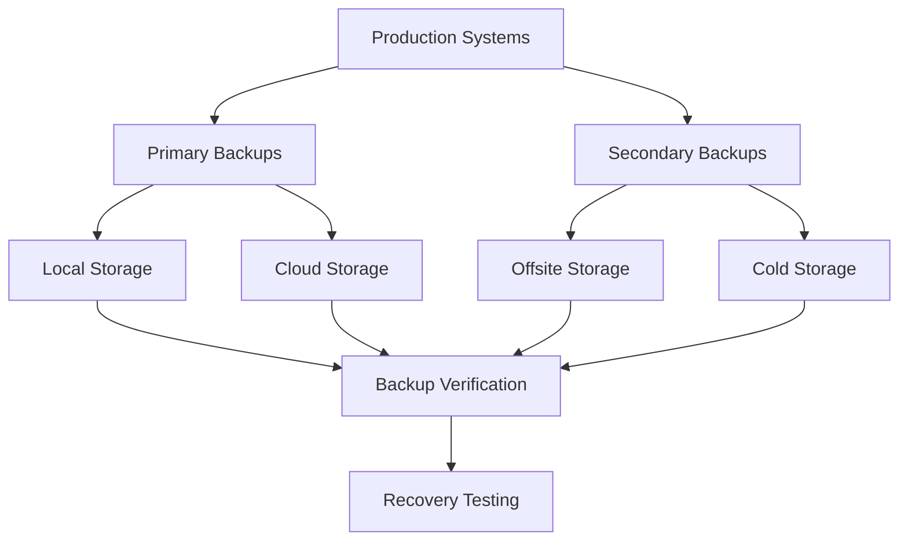
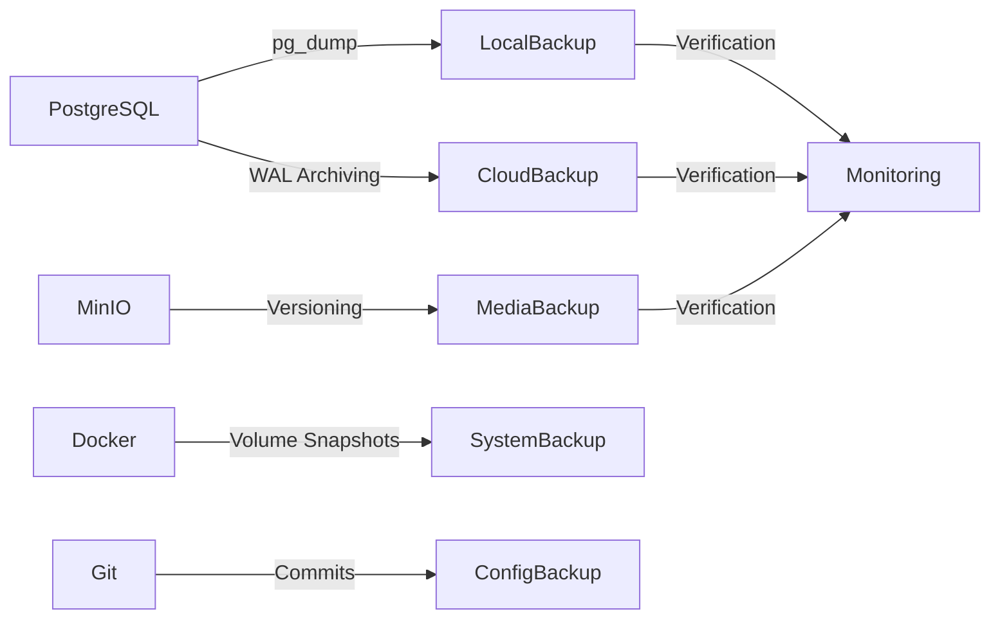
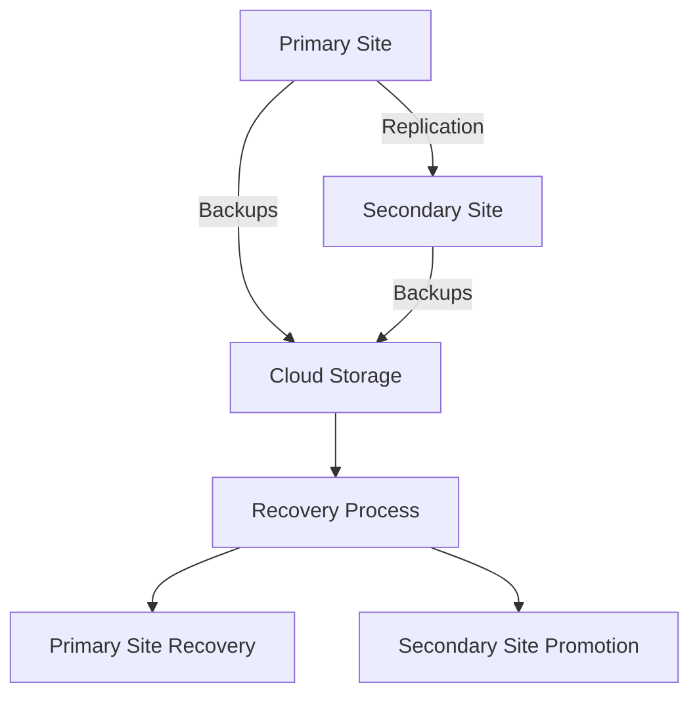

# Backup Strategy Guide

**Version**: 2025.12.04
**Last Updated**: 2025-12-04
**Status**: Active
**Owner**: Operations Team

## Table of Contents

1. [Introduction](#introduction)
2. [Backup Architecture](#backup-architecture)
3. [Backup Policy](#backup-policy)
4. [Database Backup Procedures](#database-backup-procedures)
5. [Media Storage Backup](#media-storage-backup)
6. [Configuration Backup](#configuration-backup)
7. [Backup Verification](#backup-verification)
8. [Disaster Recovery Plan](#disaster-recovery-plan)
9. [Data Restoration Procedures](#data-restoration-procedures)
10. [Backup Monitoring](#backup-monitoring)
11. [Security and Compliance](#security-and-compliance)
12. [Best Practices](#best-practices)
13. [Cross-References](#cross-references)

## Introduction

This Backup Strategy Guide provides comprehensive procedures for data protection, backup, and recovery in the SilentRelay system. It establishes a robust framework for ensuring data integrity, availability, and recoverability.

### Scope

This document applies to:
- Database backup and recovery
- Media storage protection
- Configuration backup
- Disaster recovery planning
- Backup verification and testing
- Data restoration procedures

### Target Audience

- **Primary**: Operations team responsible for data protection
- **Secondary**: System administrators managing backup systems
- **Tertiary**: Development team requiring backup context

## Backup Architecture

### Backup System Overview



### Backup Components

| Component | Technology | Frequency | Retention |
|-----------|-----------|-----------|-----------|
| Database | PostgreSQL pg_dump | Daily | 90 days |
| Media | MinIO versioning | Hourly | 30 days |
| Configuration | Git versioning | Continuous | Permanent |
| System State | Docker volumes | Weekly | 30 days |
| Audit Logs | Encrypted archives | Daily | 365 days |

### Data Flow



## Backup Policy

### Backup Requirements

| Data Type | Backup Frequency | Retention Period | Recovery Objective |
|-----------|------------------|-------------------|----------------------|
| User Data | Daily | 90 days | < 1 hour |
| Messages | Hourly | 30 days | < 30 minutes |
| Media | Continuous | 30 days | < 15 minutes |
| Configuration | Continuous | Permanent | < 5 minutes |
| System State | Weekly | 30 days | < 2 hours |
| Audit Logs | Daily | 365 days | < 4 hours |

### Compliance Requirements

| Regulation | Requirement | Implementation |
|------------|-------------|----------------|
| GDPR | Right to erasure | Automated data deletion |
| HIPAA | Data protection | Encrypted backups |
| SOC 2 | Backup testing | Quarterly recovery tests |
| ISO 27001 | Data integrity | Checksum verification |
| PCI DSS | Secure storage | Encrypted backup media |

### Backup Service Level Agreements

| Metric | Target | Measurement |
|--------|--------|------------|
| RPO (Recovery Point Objective) | 1 hour | Maximum data loss |
| RTO (Recovery Time Objective) | 2 hours | Maximum downtime |
| Backup Success Rate | 99.9% | Monthly average |
| Recovery Success Rate | 100% | Quarterly tests |
| Backup Verification | 100% | All backups tested |

## Database Backup Procedures

### PostgreSQL Backup Methods

1. **Logical Backups (pg_dump)**
   ```bash
   # Full database backup
   pg_dump -U messaging -h localhost -p 5432 -F c -b -v -f /backups/messaging_full_$(date +%Y%m%d_%H%M%S).dump messaging

   # Schema-only backup
   pg_dump -U messaging -h localhost -p 5432 -s -f /backups/messaging_schema_$(date +%Y%m%d).sql messaging

   # Data-only backup
   pg_dump -U messaging -h localhost -p 5432 -a -f /backups/messaging_data_$(date +%Y%m%d).sql messaging
   ```

2. **Physical Backups (filesystem level)**
   ```bash
   # Stop PostgreSQL service
   docker-compose stop postgres

   # Backup data directory
   tar -czvf /backups/postgres_data_$(date +%Y%m%d).tar.gz /var/lib/postgresql/data

   # Restart PostgreSQL
   docker-compose start postgres
   ```

3. **Continuous Archiving (WAL)**
   ```bash
   # Configure WAL archiving in postgresql.conf
   wal_level = replica
   archive_mode = on
   archive_command = 'test ! -f /backups/wal/%f && cp %p /backups/wal/%f'

   # Restart PostgreSQL
   docker-compose restart postgres
   ```

### Automated Backup Script

```bash
#!/bin/bash
# automated_backup.sh

# Configuration
BACKUP_DIR="/backups/postgres"
RETENTION_DAYS=90
DATE=$(date +%Y%m%d_%H%M%S)

# Create backup directory
mkdir -p $BACKUP_DIR

# Perform backup
pg_dump -U messaging -h localhost -p 5432 -F c -b -v -f $BACKUP_DIR/messaging_$DATE.dump messaging

# Verify backup
if [ $? -eq 0 ]; then
    echo "Backup successful: $BACKUP_DIR/messaging_$DATE.dump"
else
    echo "Backup failed" | mail -s "PostgreSQL Backup Failed" ops-team@example.com
    exit 1
fi

# Cleanup old backups
find $BACKUP_DIR -name "messaging_*.dump" -mtime +$RETENTION_DAYS -delete

# Update backup catalog
echo "$DATE,$BACKUP_DIR/messaging_$DATE.dump" >> $BACKUP_DIR/backup_catalog.csv
```

### Backup Scheduling

```bash
# Add to crontab
0 2 * * * /usr/local/bin/automated_backup.sh >> /var/log/backup.log 2>&1

# Weekly full backup
0 3 * * 0 /usr/local/bin/weekly_full_backup.sh

# Monthly backup verification
0 4 1 * * /usr/local/bin/monthly_backup_verification.sh
```

## Media Storage Backup

### MinIO Backup Configuration

```bash
# Enable versioning on MinIO bucket
mc version enable messenger/media

# Set retention policy
mc version suspend messenger/media

# Configure lifecycle rules
cat > lifecycle.json <<EOF
{
  "Rule": {
    "ID": "MediaRetention",
    "Status": "Enabled",
    "Expiration": {
      "Days": 90
    },
    "Filter": {
      "Prefix": ""
    }
  }
}
EOF

mc lifecycle set JSON lifecycle.json messenger/media
```

### Media Backup Procedures

1. **Automated Media Backup**
   ```bash
   # Sync media to backup location
   mc mirror messenger/media messenger-backup/media

   # Verify sync
   mc diff messenger/media messenger-backup/media
   ```

2. **Media Recovery**
   ```bash
   # Restore specific file
   mc cp messenger-backup/media/path/to/file.jpg messenger/media/path/to/file.jpg

   # Restore entire bucket
   mc mirror messenger-backup/media messenger/media
   ```

### Media Backup Monitoring

```promql
# Monitor media storage usage
minio_bucket_usage_bytes{bucket="media"}

# Alert on backup failures
- alert: MediaBackupFailure
  expr: minio_replication_lag_seconds > 3600
  for: 30m
  labels:
    severity: critical
  annotations:
    summary: "Media backup replication lagging"
```

## Configuration Backup

### Configuration Management

1. **Git-Based Configuration**
   ```bash
   # Commit configuration changes
   git add internal/config/config.go
   git commit -m "Update rate limits to 150 req/s"
   git tag config/v1.2.3
   git push origin config/v1.2.3

   # Create configuration backup
   git archive --format=tar.gz --output=/backups/config_$(date +%Y%m%d).tar.gz HEAD
   ```

2. **Docker Configuration Backup**
   ```bash
   # Backup Docker configurations
   tar -czvf /backups/docker_config_$(date +%Y%m%d).tar.gz \
     docker-compose.yml \
     infrastructure/ \
     .env

   # Backup service configurations
   docker-compose config > /backups/docker-compose_$(date +%Y%m%d).config
   ```

### Configuration Versioning

```markdown
**Configuration Version History**:

| Version | Date | Changes | Author |
|---------|------|---------|--------|
| v1.2.3 | 2025-12-04 | Updated rate limits, added monitoring | DevOps Team |
| v1.2.2 | 2025-11-15 | Security hardening, certificate updates | Security Team |
| v1.2.1 | 2025-10-01 | Performance optimization, caching | Performance Team |
```

## Backup Verification

### Backup Integrity Testing

1. **Database Backup Verification**
   ```bash
   # Test database restore
   createdb -U messaging messaging_test
   pg_restore -U messaging -h localhost -p 5432 -d messaging_test -c -v /backups/messaging_latest.dump

   # Run integrity checks
   psql -U messaging -h localhost -p 5432 -d messaging_test -c "SELECT COUNT(*) FROM messages;"
   ```

2. **Media Backup Verification**
   ```bash
   # Verify media integrity
   mc find messenger-backup/media --name "*.jpg" | head -10 | while read file; do
       file $file
       md5sum $file
   done
   ```

### Automated Verification Script

```bash
#!/bin/bash
# backup_verification.sh

# Database verification
echo "Testing database backup..."
createdb -U messaging messaging_test
pg_restore -U messaging -h localhost -p 5432 -d messaging_test -c /backups/messaging_latest.dump

# Check table counts
DB_CHECK=$(psql -U messaging -h localhost -p 5432 -d messaging_test -t -c "SELECT COUNT(*) FROM messages;")
if [ "$DB_CHECK" -gt "0" ]; then
    echo "Database backup verified: $DB_CHECK messages"
else
    echo "Database backup verification failed"
    exit 1
fi

# Media verification
echo "Testing media backup..."
MEDIA_CHECK=$(mc find messenger-backup/media --name "*.jpg" | wc -l)
if [ "$MEDIA_CHECK" -gt "0" ]; then
    echo "Media backup verified: $MEDIA_CHECK files"
else
    echo "Media backup verification failed"
    exit 1
fi

# Configuration verification
echo "Testing configuration backup..."
CONFIG_CHECK=$(tar -tzf /backups/config_latest.tar.gz | wc -l)
if [ "$CONFIG_CHECK" -gt "0" ]; then
    echo "Configuration backup verified: $CONFIG_CHECK files"
else
    echo "Configuration backup verification failed"
    exit 1
fi

echo "All backup verifications passed"
```

### Verification Scheduling

```bash
# Weekly verification
0 5 * * 1 /usr/local/bin/backup_verification.sh >> /var/log/backup_verification.log 2>&1

# Monthly comprehensive verification
0 6 1 * * /usr/local/bin/comprehensive_verification.sh
```

## Disaster Recovery Plan

### Disaster Recovery Architecture



### Recovery Scenarios

| Scenario | Recovery Procedure | RTO | RPO |
|----------|---------------------|-----|-----|
| Single Server Failure | Failover to replica | 15 min | 5 min |
| Data Center Outage | Activate secondary site | 2 hours | 1 hour |
| Database Corruption | Restore from backup | 1 hour | 15 min |
| Media Storage Failure | Restore from versioned backup | 30 min | 1 min |
| Configuration Loss | Restore from Git | 5 min | 0 min |

### Disaster Recovery Procedures

1. **Primary Site Failure**
   ```markdown
   **Detection**: Monitoring alerts, service unavailability
   **Response**:
   - Activate secondary site
   - Update DNS records
   - Verify secondary site functionality
   - Begin primary site recovery
   ```

2. **Database Corruption**
   ```markdown
   **Detection**: Database errors, data inconsistencies
   **Response**:
   - Isolate corrupted database
   - Restore from most recent clean backup
   - Replay WAL logs to catch up
   - Verify data integrity
   ```

3. **Complete Data Loss**
   ```markdown
   **Detection**: Storage failure, catastrophic loss
   **Response**:
   - Activate disaster recovery plan
   - Restore from offsite backups
   - Verify all critical data restored
   - Gradual service restoration
   ```

### Recovery Testing

```bash
# Quarterly disaster recovery test
0 0 1 */3 * /usr/local/bin/disaster_recovery_test.sh

# Test failover procedure
docker-compose -f docker-compose-dr.yml up -d

# Verify recovery
./scripts/verify_recovery.sh
```

## Data Restoration Procedures

### Database Restoration

1. **Full Database Restore**
   ```bash
   # Create new database
   createdb -U messaging messaging_restore

   # Restore from backup
   pg_restore -U messaging -h localhost -p 5432 -d messaging_restore -c -v -j 4 /backups/messaging_20251204.dump

   # Verify restoration
   psql -U messaging -h localhost -p 5432 -d messaging_restore -c "SELECT COUNT(*) FROM messages;"
   ```

2. **Point-in-Time Recovery**
   ```bash
   # Restore to specific timestamp
   pg_restore -U messaging -h localhost -p 5432 -d messaging_restore \
     --clean --if-exists \
     --restore-time="2025-12-04 14:30:00" \
     /backups/messaging_20251204.dump
   ```

### Media Restoration

```bash
# Restore specific media file
mc cp messenger-backup/media/2025/12/04/file.jpg messenger/media/2025/12/04/file.jpg

# Restore entire media collection
mc mirror messenger-backup/media messenger/media

# Verify media integrity
find /media -name "*.jpg" -exec file {} \; | grep -v "corrupt"
```

### Configuration Restoration

```bash
# Restore configuration from backup
tar -xzvf /backups/config_20251204.tar.gz -C /restore

# Apply configuration
cp /restore/internal/config/config.go ./internal/config/
docker-compose restart chat-server

# Verify configuration
go run cmd/chatserver/main.go --validate-config
```

## Backup Monitoring

### Backup Monitoring Metrics

```promql
# Backup success rate
rate(backup_success_total[7d]) / rate(backup_attempts_total[7d])

# Backup duration
backup_duration_seconds

# Backup size trends
backup_size_bytes

# Backup age
time() - backup_timestamp_seconds
```

### Alert Rules

```yaml
# Backup alert rules
- alert: BackupFailure
  expr: rate(backup_failures_total[5m]) > 0
  for: 5m
  labels:
    severity: critical
  annotations:
    summary: "Backup failure detected"
    description: "Backup job failed for {{ $labels.job }}"

- alert: OldBackup
  expr: time() - backup_timestamp_seconds > 86400
  for: 1h
  labels:
    severity: warning
  annotations:
    summary: "No recent backups"
    description: "Last backup for {{ $labels.job }} was {{ $value }} seconds ago"

- alert: BackupSizeIncrease
  expr: increase(backup_size_bytes[7d]) / increase(backup_size_bytes[30d]) > 1.5
  for: 1h
  labels:
    severity: warning
  annotations:
    summary: "Rapid backup size growth"
    description: "Backup size increased by {{ $value }}% over last week"
```

### Backup Dashboard

```json
{
  "title": "Backup Monitoring",
  "panels": [
    {
      "title": "Backup Success Rate",
      "type": "gauge",
      "targets": [
        {
          "expr": "rate(backup_success_total[7d]) / rate(backup_attempts_total[7d])",
          "legendFormat": "Success Rate"
        }
      ],
      "thresholds": {
        "mode": "percentage",
        "steps": [
          { "color": "red", "value": 0.9 },
          { "color": "orange", "value": 0.95 },
          { "color": "green", "value": 0.99 }
        ]
      }
    },
    {
      "title": "Backup Duration",
      "type": "graph",
      "targets": [
        {
          "expr": "backup_duration_seconds",
          "legendFormat": "Duration"
        }
      ]
    }
  ]
}
```

## Security and Compliance

### Backup Security Measures

1. **Encryption**
   ```bash
   # Encrypt backups
   openssl enc -aes-256-cbc -salt -in /backups/messaging.dump -out /backups/messaging.enc

   # Decrypt backups
   openssl enc -d -aes-256-cbc -in /backups/messaging.enc -out /backups/messaging.dump
   ```

2. **Access Control**
   ```bash
   # Set backup permissions
   chmod 600 /backups/*
   chown backup-user:backup-group /backups/*

   # Configure backup access
   setfacl -m u:backup-user:rwx /backups
   ```

### Compliance Procedures

1. **Data Retention Compliance**
   ```markdown
   **GDPR Compliance**:
   - Implement automated data deletion
   - Maintain deletion logs
   - Provide user data export capability

   **HIPAA Compliance**:
   - Encrypt all protected health information
   - Maintain audit trails
   - Implement access controls
   ```

2. **Audit Procedures**
   ```bash
   # Generate backup audit report
   ./scripts/generate_backup_audit.sh > /reports/backup_audit_$(date +%Y%m%d).txt

   # Verify compliance
   ./scripts/verify_compliance.sh
   ```

## Best Practices

### Backup Best Practices

1. **Backup Strategy**
   - Implement 3-2-1 rule (3 copies, 2 media types, 1 offsite)
   - Test backups regularly
   - Monitor backup success rates
   - Document all backup procedures

2. **Security Practices**
   - Encrypt all backups
   - Implement strict access controls
   - Maintain backup integrity checks
   - Monitor for unauthorized access

3. **Operational Practices**
   - Automate backup processes
   - Monitor backup storage capacity
   - Regularly review retention policies
   - Document all recovery procedures

### Recovery Best Practices

1. **Recovery Planning**
   - Document all recovery scenarios
   - Test recovery procedures regularly
   - Maintain recovery time objectives
   - Train team on recovery processes

2. **Recovery Execution**
   - Follow documented procedures
   - Verify data integrity post-recovery
   - Monitor system post-recovery
   - Document all recovery actions

## Cross-References

### Related Documentation

- [System Administration Guide](SYSTEM_ADMINISTRATION_GUIDE.md) - System management
- [Monitoring Setup Guide](MONITORING_SETUP_GUIDE.md) - Monitoring infrastructure
- [Incident Response Playbook](INCIDENT_RESPONSE_PLAYBOOK.md) - Incident procedures
- [Maintenance Procedures](MAINTENANCE_PROCEDURES.md) - Maintenance tasks

### Configuration Files

- [`docker-compose.yml`](../docker-compose.yml) - Service orchestration
- [`infrastructure/prometheus/alert.rules.yml`](../infrastructure/prometheus/alert.rules.yml) - Alert rules
- [`internal/config/config.go`](../internal/config/config.go) - Application configuration

### Backup Tools

- **Database**: `pg_dump`, `pg_restore`, `WAL archiving`
- **Media**: `mc` (MinIO client), versioning
- **Configuration**: Git, tar
- **Monitoring**: Prometheus, Grafana

## Change Log

| Version | Date | Changes | Author |
|---------|------|---------|--------|
| 2025.12.04 | 2025-12-04 | Initial document creation | Operations Team |
| | | Added comprehensive backup procedures | |
| | | Added disaster recovery planning | |
| | | Added backup verification procedures | |

## Next Steps

1. **Review** backup strategy and procedures
2. **Test** all backup and recovery processes
3. **Document** any additional backup requirements
4. **Integrate** with monitoring and alerting systems

This Backup Strategy Guide provides comprehensive procedures for data protection and recovery. Refer to the [Operational Documentation Index](OPERATIONAL_DOCUMENTATION_INDEX.md) for the complete documentation suite.