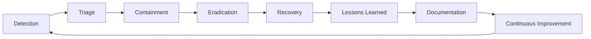
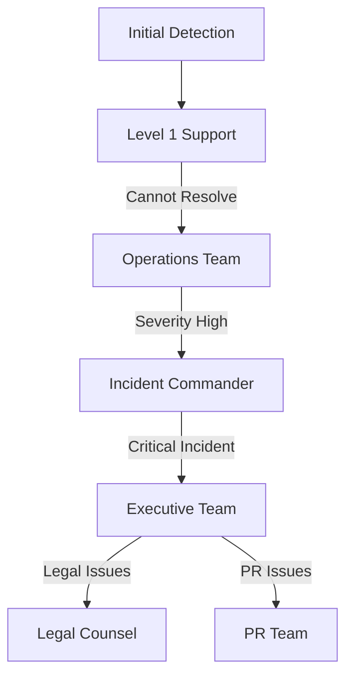

# Incident Response Playbook

**Version**: 2025.12.04
**Last Updated**: 2025-12-04
**Status**: Active
**Owner**: Security Operations Team

## Table of Contents

1. [Introduction](#introduction)
2. [Incident Response Framework](#incident-response-framework)
3. [Incident Classification](#incident-classification)
4. [Response Team Structure](#response-team-structure)
5. [Incident Response Procedures](#incident-response-procedures)
6. [Communication Protocols](#communication-protocols)
7. [Specific Incident Scenarios](#specific-incident-scenarios)
8. [Post-Incident Procedures](#post-incident-procedures)
9. [Training and Preparedness](#training-and-preparedness)
10. [Tools and Resources](#tools-and-resources)
11. [Best Practices](#best-practices)
12. [Cross-References](#cross-references)

## Introduction

This Incident Response Playbook provides comprehensive procedures for responding to security incidents and service disruptions in the SilentRelay system. It establishes a structured approach to incident handling, communication, and recovery.

### Scope

This document applies to:
- Security incidents (breaches, attacks, vulnerabilities)
- Service disruptions (outages, performance issues)
- Data integrity incidents (corruption, loss)
- Compliance violations (policy breaches, audit findings)

### Target Audience

- **Primary**: Security operations team
- **Secondary**: System administrators and operations staff
- **Tertiary**: Development team and management

## Incident Response Framework

### Incident Response Lifecycle



### Response Phases

| Phase | Objective | Duration | Responsible Team |
|-------|-----------|----------|------------------|
| Detection | Identify and confirm incident | Immediate | Monitoring Team |
| Triage | Assess severity and impact | 15-30 min | Incident Commander |
| Containment | Isolate and limit impact | 1-4 hours | Response Team |
| Eradication | Remove root cause | 2-24 hours | Technical Team |
| Recovery | Restore normal operations | 1-48 hours | Operations Team |
| Lessons Learned | Analyze and improve | 1-2 weeks | All Teams |

### Incident Response Principles

1. **Preserve Evidence**: Maintain chain of custody for all incident data
2. **Minimize Impact**: Prioritize containment and user protection
3. **Clear Communication**: Maintain transparent communication channels
4. **Document Everything**: Record all actions and decisions
5. **Continuous Improvement**: Learn from every incident

## Incident Classification

### Severity Levels

| Level | Criteria | Response Time | Escalation |
|-------|----------|---------------|------------|
| Critical | System-wide outage, data breach, compliance violation | Immediate | Executive Team |
| High | Major service degradation, security vulnerability | < 1 hour | Management Team |
| Medium | Partial service impact, minor security issue | < 4 hours | Operations Team |
| Low | Localized issue, minor performance impact | < 24 hours | Support Team |

### Incident Types

| Type | Description | Example |
|------|-------------|---------|
| Security Breach | Unauthorized access or data exposure | Database compromise, account takeover |
| Service Outage | Complete or partial service unavailability | Chat server failure, database crash |
| Performance Degradation | System slowdown or resource exhaustion | High latency, memory leaks |
| Data Integrity | Data corruption or loss | Database corruption, backup failure |
| Compliance Violation | Policy or regulatory breach | Audit failure, data retention violation |
| Third-Party Incident | Vendor or dependency issue | Cloud provider outage, library vulnerability |

## Response Team Structure

### Incident Response Roles

| Role | Responsibilities | Primary | Backup |
|------|-------------------|---------|--------|
| Incident Commander | Overall coordination and decision making | Security Lead | Operations Lead |
| Technical Lead | Technical analysis and resolution | DevOps Engineer | Senior Developer |
| Communications Lead | Internal and external communications | PR Manager | Support Manager |
| Documentation Lead | Incident documentation and reporting | Operations Analyst | Security Analyst |
| Legal/Compliance | Legal and regulatory considerations | Legal Counsel | Compliance Officer |

### Escalation Path



### Contact Information

| Role | Name | Phone | Email | Slack |
|------|------|-------|-------|-------|
| Incident Commander | John Smith | +1-555-123-4567 | john.smith@example.com | @john-smith |
| Technical Lead | Sarah Johnson | +1-555-234-5678 | sarah.j@example.com | @sarah-j |
| Communications Lead | Mike Chen | +1-555-345-6789 | mike.chen@example.com | @mike-c |
| Documentation Lead | Emma Wilson | +1-555-456-7890 | emma.w@example.com | @emma-w |

## Incident Response Procedures

### Initial Response Checklist

```markdown
- [ ] Confirm incident (not false positive)
- [ ] Classify severity and type
- [ ] Activate response team
- [ ] Establish communication channels
- [ ] Begin incident documentation
- [ ] Notify stakeholders as appropriate
- [ ] Implement initial containment measures
```

### Detection and Triage

1. **Incident Confirmation**
   ```bash
   # Check monitoring alerts
   curl http://localhost:9090/api/v1/alerts

   # Review recent logs
   docker-compose logs --tail=100 chat-server | grep ERROR
   ```

2. **Severity Assessment**
   ```promql
   # Check system health
   avg(up) by (job)

   # Check error rates
   rate(messenger_http_requests_total{status=~"5.."}[5m])
   ```

3. **Incident Declaration**
   ```bash
   # Declare incident in monitoring system
   curl -X POST http://localhost:8080/api/v1/admin/incidents \
     -H "Authorization: Bearer $ADMIN_TOKEN" \
     -H "Content-Type: application/json" \
     -d '{"type": "security_breach", "severity": "critical", "description": "Unauthorized database access detected"}'
   ```

### Containment Procedures

1. **Service Isolation**
   ```bash
   # Take affected service offline
   docker-compose stop chat-server

   # Disable affected functionality
   curl -X POST http://localhost:8080/api/v1/admin/maintenance \
     -H "Authorization: Bearer $ADMIN_TOKEN" \
     -H "Content-Type: application/json" \
     -d '{"enabled": true, "message": "Security incident - service temporarily unavailable"}'
   ```

2. **Network Containment**
   ```bash
   # Block suspicious IPs
   iptables -A INPUT -s 192.168.1.100 -j DROP

   # Update firewall rules
   ufw deny from 192.168.1.100
   ```

3. **Data Preservation**
   ```bash
   # Create forensic copies
   docker exec postgres pg_dump -U messaging -F c -f /forensics/incident_$(date +%Y%m%d).dump messaging

   # Preserve logs
   docker-compose logs chat-server > /forensics/chat_server_$(date +%Y%m%d).log
   ```

### Eradication Procedures

1. **Root Cause Analysis**
   ```bash
   # Analyze security logs
   grep "SECURITY" /var/log/messenger/*.log

   # Check intrusion detection alerts
   curl http://localhost:8080/api/v1/security/alerts
   ```

2. **Vulnerability Patching**
   ```bash
   # Apply security patches
   apt-get update && apt-get upgrade -y

   # Update vulnerable dependencies
   go get -u github.com/vulnerable/package
   ```

3. **System Remediation**
   ```bash
   # Rotate compromised credentials
   curl -X POST http://localhost:8080/api/v1/admin/security/rotate-keys \
     -H "Authorization: Bearer $ADMIN_TOKEN"

   # Rebuild affected services
   docker-compose build --no-cache chat-server
   ```

### Recovery Procedures

1. **System Restoration**
   ```bash
   # Restore from clean backup
   pg_restore -U messaging -h localhost -p 5432 -d messaging -c -v /backups/clean_backup.dump

   # Restart services
   docker-compose up -d chat-server
   ```

2. **Service Validation**
   ```bash
   # Verify service health
   curl http://localhost:8080/health

   # Test critical functionality
   ./scripts/test-critical-path.sh
   ```

3. **Monitoring Reinstatement**
   ```bash
   # Re-enable monitoring
   curl -X POST http://localhost:8080/api/v1/admin/monitoring \
     -H "Authorization: Bearer $ADMIN_TOKEN" \
     -H "Content-Type: application/json" \
     -d '{"enabled": true}'
   ```

## Communication Protocols

### Internal Communication

1. **Incident Declaration Template**
   ```
   INCIDENT DECLARED

   Type: [Security Breach/Service Outage/Performance Issue]
   Severity: [Critical/High/Medium/Low]
   Detected: [Timestamp]
   Detected By: [Name/Team]
   Initial Impact Assessment: [Brief description]

   Response Team Activated: [Yes/No]
   Incident Commander: [Name]
   Communication Lead: [Name]

   Initial Actions Taken:
   - [Action 1]
   - [Action 2]

   Next Steps:
   - [Next action]
   - [Expected timeline]

   Updates will be posted in this channel.
   ```

2. **Status Update Template**
   ```
   INCIDENT UPDATE #X

   Time: [Timestamp]
   Status: [Investigating/Contained/Resolved]
   Current Impact: [Description]
   Root Cause: [Identified/Investigating/Unknown]
   ETA for Resolution: [Timeframe]

   Actions Completed:
   - [Action 1]
   - [Action 2]

   Next Steps:
   - [Next action]
   - [Expected timeline]

   Contact: [Incident Commander Name] @slack-handle
   ```

### External Communication

1. **User Communication Template**
   ```
   Subject: Service Update - [Brief Description]

   Dear SilentRelay Users,

   We are currently experiencing [brief description of issue] and our team is actively working to resolve it. We apologize for any inconvenience caused.

   Current Status: [Investigating/Resolved]
   Expected Resolution: [Timeframe if available]

   We will provide updates as more information becomes available. Thank you for your patience.

   Sincerely,
   The SilentRelay Team
   ```

2. **Status Page Update**
   ```bash
   # Update status page
   curl -X POST http://localhost:8080/api/v1/admin/status \
     -H "Authorization: Bearer $ADMIN_TOKEN" \
     -H "Content-Type: application/json" \
     -d '{
       "status": "degraded",
       "message": "We are experiencing elevated error rates and investigating the issue.",
       "components": {
         "chat": "operational",
         "media": "degraded",
         "authentication": "operational"
       }
     }'
   ```

## Specific Incident Scenarios

### Security Breach Response

1. **Database Compromise**
   ```markdown
   **Detection**: Unusual query patterns, unauthorized access alerts
   **Containment**:
   - Isolate database server
   - Revoke all active sessions
   - Block suspicious IPs
   **Eradication**:
   - Rotate all database credentials
   - Review and patch vulnerabilities
   - Restore from clean backup
   **Recovery**:
   - Gradual service restoration
   - Monitor for recurrence
   - Implement additional safeguards
   ```

2. **Account Takeover**
   ```markdown
   **Detection**: Unusual login patterns, multiple failed attempts
   **Containment**:
   - Lock affected accounts
   - Force password/recovery key reset
   - Enable strict rate limiting
   **Eradication**:
   - Investigate compromise vector
   - Implement additional authentication checks
   - Notify affected users
   **Recovery**:
   - Assist users with account recovery
   - Monitor for additional attempts
   - Review authentication logs
   ```

### Service Outage Response

1. **Chat Server Failure**
   ```markdown
   **Detection**: Service health checks failing, user reports
   **Containment**:
   - Redirect traffic to backup servers
   - Enable maintenance mode
   - Increase monitoring frequency
   **Eradication**:
   - Identify root cause (resource exhaustion, crash)
   - Apply fixes or patches
   - Test resolution
   **Recovery**:
   - Gradual traffic restoration
   - Monitor system health
   - Communicate resolution
   ```

2. **Database Unavailability**
   ```markdown
   **Detection**: Connection failures, timeout errors
   **Containment**:
   - Failover to replica if available
   - Enable read-only mode
   - Queue incoming messages
   **Eradication**:
   - Restart database service
   - Check for corruption
   - Apply configuration fixes
   **Recovery**:
   - Restore full functionality
   - Process queued messages
   - Verify data integrity
   ```

### Performance Degradation Response

1. **High Latency Incident**
   ```markdown
   **Detection**: Increased response times, user complaints
   **Containment**:
   - Scale up affected services
   - Implement rate limiting
   - Redirect non-critical traffic
   **Eradication**:
   - Identify bottleneck (database, network, CPU)
   - Optimize queries or configuration
   - Add caching where appropriate
   **Recovery**:
   - Gradually restore normal operations
   - Monitor performance metrics
   - Document optimization opportunities
   ```

2. **Resource Exhaustion**
   ```markdown
   **Detection**: High CPU/memory usage, service slowdowns
   **Containment**:
   - Scale out services
   - Implement stricter rate limits
   - Prioritize critical operations
   **Eradication**:
   - Identify resource hogs
   - Optimize resource usage
   - Add monitoring for early detection
   **Recovery**:
   - Restore normal resource levels
   - Monitor for recurrence
   - Plan capacity increases
   ```

## Post-Incident Procedures

### Incident Documentation

1. **Incident Report Template**
   ```markdown
   # Incident Report - [Incident ID]

   ## Summary
   - **Type**: [Security/Service/Performance]
   - **Severity**: [Critical/High/Medium/Low]
   - **Start Time**: [Timestamp]
   - **End Time**: [Timestamp]
   - **Duration**: [Calculated]
   - **Impact**: [User count, service availability]

   ## Timeline
   | Time | Event | Responsible |
   |------|-------|-------------|
   | [Time] | Incident detected | [Team] |
   | [Time] | Response team activated | [Team] |
   | [Time] | Containment implemented | [Team] |
   | [Time] | Root cause identified | [Team] |
   | [Time] | Service restored | [Team] |

   ## Root Cause Analysis
   - **Primary Cause**: [Detailed description]
   - **Contributing Factors**: [List of factors]
   - **Preventive Measures**: [Recommendations]

   ## Response Effectiveness
   - **Detection Time**: [Minutes from start to detection]
   - **Response Time**: [Minutes from detection to containment]
   - **Resolution Time**: [Minutes from containment to recovery]
   - **Communication Effectiveness**: [Rating 1-5]

   ## Lessons Learned
   - [Lesson 1]
   - [Lesson 2]
   - [Lesson 3]

   ## Action Items
   - [ ] [Action 1] - [Owner] - [Due Date]
   - [ ] [Action 2] - [Owner] - [Due Date]
   - [ ] [Action 3] - [Owner] - [Due Date]
   ```

2. **Incident Metrics Collection**
   ```promql
   # Gather incident metrics
   rate(messenger_http_requests_total{status="5xx"}[1h])

   # Analyze performance impact
   histogram_quantile(0.95, sum(rate(messenger_message_delivery_latency_seconds_bucket[1h])) by (le))
   ```

### Continuous Improvement

1. **Incident Review Meeting**
   ```markdown
   **Agenda**:
   - Review incident timeline
   - Discuss root cause analysis
   - Evaluate response effectiveness
   - Identify improvement opportunities
   - Assign action items

   **Participants**:
   - Incident Commander
   - Technical Lead
   - Communications Lead
   - Documentation Lead
   - Relevant team members
   ```

2. **Procedure Updates**
   ```bash
   # Update playbook based on lessons learned
   vim docs/INCIDENT_RESPONSE_PLAYBOOK.md

   # Commit changes
   git add docs/INCIDENT_RESPONSE_PLAYBOOK.md
   git commit -m "Update incident response procedures based on [Incident ID]"
   ```

## Training and Preparedness

### Training Program

1. **Incident Response Training**
   ```markdown
   **Quarterly Training Schedule**:
   - January: Basic incident response procedures
   - April: Advanced threat scenarios
   - July: Communication and coordination
   - October: Full-scale simulation

   **Training Components**:
   - Role-specific responsibilities
   - Tool usage and procedures
   - Communication protocols
   - Decision-making frameworks
   ```

2. **Simulation Exercises**
   ```markdown
   **Simulation Scenarios**:
   - Database breach with data exfiltration
   - Distributed denial of service attack
   - Zero-day vulnerability exploitation
   - Cloud provider outage
   - Insider threat scenario

   **Exercise Format**:
   - 1 hour preparation
   - 2 hour simulation
   - 1 hour debrief
   - Action item follow-up
   ```

### Preparedness Checklist

```markdown
- [ ] Incident response team contact list updated
- [ ] Communication channels tested
- [ ] Monitoring alerts configured and tested
- [ ] Backup and recovery procedures verified
- [ ] Incident documentation templates available
- [ ] Response tools accessible and functional
- [ ] Training completed for all team members
- [ ] Simulation exercises conducted quarterly
```

## Tools and Resources

### Incident Response Tools

| Tool | Purpose | Access |
|------|---------|--------|
| Prometheus/Grafana | Monitoring and alerting | Operations Team |
| Loki | Log analysis | Operations Team |
| Security Dashboard | Security event monitoring | Security Team |
| Incident Tracker | Incident documentation | All Teams |
| Communication Platform | Team coordination | All Teams |
| Forensic Tools | Evidence collection | Security Team |

### Resource Inventory

```markdown
**Monitoring Resources**:
- Prometheus server: http://localhost:9090
- Grafana dashboards: http://localhost:3000
- Alert manager: http://localhost:9093

**Response Resources**:
- Incident documentation: [Confluence/Notion link]
- Runbooks and procedures: [Documentation link]
- Contact lists: [Secure contact database]
- Backup systems: [Backup server access]
```

## Best Practices

### Incident Response Best Practices

1. **Preparation**
   - Maintain updated response procedures
   - Conduct regular training and simulations
   - Test monitoring and alerting systems
   - Verify backup and recovery capabilities

2. **Response**
   - Follow established procedures
   - Maintain clear communication
   - Document all actions and decisions
   - Prioritize containment and evidence preservation

3. **Recovery**
   - Verify system integrity before restoration
   - Monitor for recurrence or related issues
   - Communicate transparently with stakeholders
   - Conduct thorough post-incident analysis

4. **Continuous Improvement**
   - Review and update procedures regularly
   - Incorporate lessons learned from incidents
   - Stay current with threat landscape
   - Enhance monitoring and detection capabilities

### Communication Best Practices

1. **Internal Communication**
   - Use designated communication channels
   - Provide regular updates (minimum hourly for critical incidents)
   - Maintain clear role assignments
   - Document all decisions and rationales

2. **External Communication**
   - Be transparent about impact and timeline
   - Provide regular updates (even if no new information)
   - Avoid technical jargon in user communications
   - Maintain consistent messaging across channels

## Cross-References

### Related Documentation

- [System Administration Guide](SYSTEM_ADMINISTRATION_GUIDE.md) - System management procedures
- [Monitoring Setup Guide](MONITORING_SETUP_GUIDE.md) - Monitoring infrastructure
- [Maintenance Procedures](MAINTENANCE_PROCEDURES.md) - Scheduled maintenance
- [Backup Strategy Guide](BACKUP_STRATEGY_GUIDE.md) - Data protection

### Configuration Files

- [`internal/security/intrusion.go`](../internal/security/intrusion.go) - Intrusion detection
- [`internal/security/audit.go`](../internal/security/audit.go) - Audit logging
- [`infrastructure/prometheus/alert.rules.yml`](../infrastructure/prometheus/alert.rules.yml) - Alert rules

### Response Tools

- **Monitoring**: Prometheus, Grafana, Loki
- **Communication**: Slack, Status Page, Email
- **Forensics**: Security event logs, database backups
- **Recovery**: Backup restoration scripts, rollback procedures

## Change Log

| Version | Date | Changes | Author |
|---------|------|---------|--------|
| 2025.12.04 | 2025-12-04 | Initial document creation | Security Team |
| | | Added incident classification framework | |
| | | Added response procedures and templates | |
| | | Added communication protocols | |

## Next Steps

1. **Review** incident response procedures with team
2. **Conduct** initial training session
3. **Schedule** first simulation exercise
4. **Integrate** with monitoring and alerting systems

This Incident Response Playbook provides comprehensive procedures for handling security incidents and service disruptions. Refer to the [Operational Documentation Index](OPERATIONAL_DOCUMENTATION_INDEX.md) for the complete documentation suite.