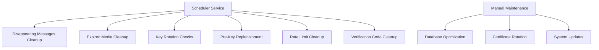
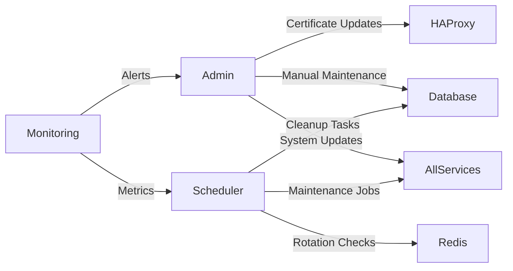
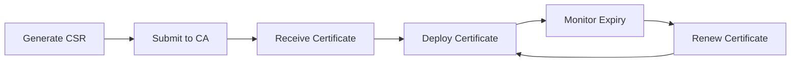

# Maintenance Procedures

**Version**: 2025.12.04
**Last Updated**: 2025-12-04
**Status**: Active
**Owner**: Operations Team

## Table of Contents

1. [Introduction](#introduction)
2. [Maintenance Architecture](#maintenance-architecture)
3. [Scheduled Maintenance Tasks](#scheduled-maintenance-tasks)
4. [Database Maintenance](#database-maintenance)
5. [Certificate Management](#certificate-management)
6. [Update and Patch Management](#update-and-patch-management)
7. [Cleanup Procedures](#cleanup-procedures)
8. [Maintenance Windows](#maintenance-windows)
9. [Rollback Procedures](#rollback-procedures)
10. [Documentation and Reporting](#documentation-and-reporting)
11. [Best Practices](#best-practices)
12. [Cross-References](#cross-references)

## Introduction

This guide provides comprehensive procedures for all maintenance activities in the SilentRelay system. It covers scheduled tasks, database maintenance, certificate management, updates, and cleanup procedures.

### Scope

This document applies to:
- Scheduled maintenance operations
- Database optimization and cleanup
- Certificate lifecycle management
- System updates and patching
- Maintenance window planning
- Rollback procedures

### Target Audience

- **Primary**: Operations team responsible for maintenance
- **Secondary**: System administrators supporting maintenance activities
- **Tertiary**: Development team requiring maintenance context

## Maintenance Architecture

### Maintenance Components



### Maintenance Services

| Service | Purpose | Frequency | Component |
|---------|---------|-----------|-----------|
| Scheduler | Automated maintenance tasks | Continuous | Go service |
| Database | Data optimization and cleanup | Weekly | PostgreSQL |
| Certificates | SSL/TLS certificate management | Quarterly | HAProxy |
| Updates | System and dependency updates | Monthly | All services |
| Cleanup | Resource reclamation | Daily | All services |

### Maintenance Data Flow



## Scheduled Maintenance Tasks

### Scheduler Service Overview

The scheduler service (`cmd/scheduler/main.go`) handles automated maintenance tasks:

```go
// Scheduler runs periodic maintenance jobs:
// - Disappearing messages cleanup
// - Expired media cleanup
// - Key rotation reminders
// - Pre-key replenishment checks
// - Rate limit cleanup
// - Verification code cleanup
```

### Scheduled Task Configuration

| Task | Frequency | Description | Component |
|------|-----------|-------------|-----------|
| Disappearing Messages Cleanup | Every 1 minute | Removes expired messages | Database |
| Expired Media Cleanup | Every 5 minutes | Removes expired media files | Database/Storage |
| Key Rotation Check | Every 1 hour | Identifies users needing key rotation | Database/Redis |
| Pre-Key Replenishment | Every 30 minutes | Checks users low on pre-keys | Database/Redis |
| Rate Limit Cleanup | Every 10 minutes | Cleans up old rate limit entries | Database |
| Verification Code Cleanup | Every 5 minutes | Removes expired verification codes | Database |

### Task Monitoring

```promql
# Monitor scheduler task execution
rate(messenger_expired_messages_cleaned_up_total[5m])

# Check key rotation notifications
sum(rate(messenger_prekeys_replenished_total[5m]))
```

## Database Maintenance

### Database Optimization Procedures

1. **Vacuum and Analyze**
   ```sql
   -- Run vacuum analyze on all tables
   VACUUM ANALYZE;

   -- Vacuum specific tables
   VACUUM FULL messages;
   VACUUM FULL users;
   ```

2. **Index Maintenance**
   ```sql
   -- Reindex tables
   REINDEX TABLE messages;
   REINDEX TABLE users;

   -- Check for unused indexes
   SELECT schemaname, tablename, indexname
   FROM pg_stat_user_indexes
   WHERE idx_scan = 0 AND idx_tup_read = 0;
   ```

3. **Table Maintenance**
   ```sql
   -- Check table bloat
   SELECT pg_size_pretty(pg_total_relation_size('messages'));

   -- Check for large tables
   SELECT table_name, pg_size_pretty(pg_total_relation_size(table_name))
   FROM information_schema.tables
   WHERE table_schema = 'public'
   ORDER BY pg_total_relation_size DESC;
   ```

### Database Cleanup Procedures

1. **Expired Data Cleanup**
   ```sql
   -- Cleanup expired messages (automated by scheduler)
   DELETE FROM messages
   WHERE expires_at < NOW()
   AND expires_at IS NOT NULL;

   -- Cleanup expired media
   DELETE FROM media
   WHERE expires_at < NOW();
   ```

2. **Orphaned Data Cleanup**
   ```sql
   -- Cleanup orphaned message attachments
   DELETE FROM message_media
   WHERE message_id NOT IN (SELECT message_id FROM messages);

   -- Cleanup orphaned user sessions
   DELETE FROM user_sessions
   WHERE user_id NOT IN (SELECT user_id FROM users);
   ```

### Database Backup Procedures

```bash
# Manual database backup
pg_dump -U messaging -h localhost -p 5432 -F c -b -v -f /backups/messaging_backup_$(date +%Y%m%d).dump messaging

# Restore database backup
pg_restore -U messaging -h localhost -p 5432 -d messaging -c -v /backups/messaging_backup_20251204.dump
```

## Certificate Management

### Certificate Lifecycle



### Certificate Generation

```bash
# Generate new SSL certificate
openssl req -x509 -nodes -days 365 -newkey rsa:2048 \
  -keyout infrastructure/certs/server.key \
  -out infrastructure/certs/server.crt \
  -subj "/CN=messenger.example.com/O=SilentRelay/C=US"

# Generate certificate signing request
openssl req -new -newkey rsa:2048 -nodes \
  -keyout infrastructure/certs/server.key \
  -out infrastructure/certs/server.csr \
  -subj "/CN=messenger.example.com/O=SilentRelay/C=US"
```

### Certificate Deployment

1. **Update HAProxy configuration**
   ```bash
   # Update SSL certificate paths
   vim infrastructure/haproxy/haproxy-ssl.cfg

   # Example configuration
   frontend https-in
     bind *:443 ssl crt /etc/haproxy/certs/server.pem
   ```

2. **Restart HAProxy**
   ```bash
   docker-compose restart loadbalancer
   ```

3. **Verify certificate**
   ```bash
   openssl s_client -connect localhost:443 -servername messenger.example.com | openssl x509 -noout -dates
   ```

### Certificate Monitoring

```promql
# Monitor certificate expiry (requires exporter)
ssl_cert_expiry_days

# Alert rule for certificate expiry
- alert: SSLCertificateExpiring
  expr: ssl_cert_expiry_days < 30
  for: 1h
  labels:
    severity: warning
  annotations:
    summary: "SSL certificate expiring soon"
    description: "Certificate for {{ $labels.instance }} expires in {{ $value }} days"
```

## Update and Patch Management

### Update Procedure

1. **Check for updates**
   ```bash
   # Check Go dependencies
   go list -u -m all

   # Check Docker images
   docker-compose pull
   ```

2. **Test updates in staging**
   ```bash
   # Update specific service
   docker-compose build --no-cache chat-server
   docker-compose up -d chat-server
   ```

3. **Deploy to production**
   ```bash
   # Rolling update procedure
   docker-compose up -d --build --scale chat-server=3 chat-server
   ```

### Patch Management

1. **Security patch procedure**
   ```bash
   # Apply security patches
   apt-get update && apt-get upgrade -y

   # Update Go dependencies
   go get -u ./...
   go mod tidy
   ```

2. **Dependency updates**
   ```bash
   # Update specific dependency
   go get github.com/redis/go-redis/v9@v9.0.5

   # Update all dependencies
   go get -u all
   ```

### Version Control

```bash
# Tag releases
git tag v1.2.3
git push origin v1.2.3

# Create release notes
git log --pretty=format:"%h %s" --since="2025-12-01" > RELEASE_NOTES.md
```

## Cleanup Procedures

### Resource Cleanup

1. **Docker system cleanup**
   ```bash
   # Remove unused containers, networks, and images
   docker system prune -a

   # Remove old volumes
   docker volume prune
   ```

2. **Log cleanup**
   ```bash
   # Rotate and compress logs
   logrotate -f /etc/logrotate.d/messenger

   # Cleanup old logs
   find /var/log/messenger -name "*.log" -mtime +30 -delete
   ```

### Temporary Data Cleanup

```sql
-- Cleanup temporary data
DELETE FROM temp_sessions WHERE created_at < NOW() - INTERVAL '24 hours';

-- Cleanup old audit logs (compliance with retention policy)
DELETE FROM audit_logs WHERE created_at < NOW() - INTERVAL '90 days';
```

## Maintenance Windows

### Maintenance Window Planning

| Window Type | Frequency | Duration | Typical Activities |
|-------------|-----------|----------|-------------------|
| Emergency | As needed | Variable | Critical security patches |
| Standard | Weekly | 2 hours | Routine maintenance |
| Major | Quarterly | 4 hours | Major updates, migrations |
| Security | Monthly | 1 hour | Security patches, cert updates |

### Maintenance Window Procedure

1. **Announce maintenance**
   ```bash
   # Send notification to users
   curl -X POST http://localhost:8080/api/v1/admin/announcements \
     -H "Authorization: Bearer $ADMIN_TOKEN" \
     -H "Content-Type: application/json" \
     -d '{"message": "Scheduled maintenance at 2AM UTC", "severity": "info"}'
   ```

2. **Enable maintenance mode**
   ```bash
   # Enable maintenance mode
   curl -X POST http://localhost:8080/api/v1/admin/maintenance \
     -H "Authorization: Bearer $ADMIN_TOKEN" \
     -H "Content-Type: application/json" \
     -d '{"enabled": true, "message": "System undergoing maintenance"}'
   ```

3. **Perform maintenance tasks**
   ```bash
   # Run maintenance scripts
   ./scripts/maintenance.sh

   # Verify completion
   ./scripts/verify-maintenance.sh
   ```

4. **Disable maintenance mode**
   ```bash
   # Disable maintenance mode
   curl -X POST http://localhost:8080/api/v1/admin/maintenance \
     -H "Authorization: Bearer $ADMIN_TOKEN" \
     -H "Content-Type: application/json" \
     -d '{"enabled": false}'
   ```

## Rollback Procedures

### Rollback Scenarios

| Scenario | Trigger | Rollback Procedure |
|----------|---------|-------------------|
| Failed update | Service failures after update | Revert to previous Docker image |
| Database corruption | Data integrity issues | Restore from backup |
| Configuration error | Misconfiguration causing outage | Revert configuration |
| Performance degradation | Update causing slowdown | Rollback and investigate |

### Rollback Procedures

1. **Service rollback**
   ```bash
   # Rollback to previous version
   docker-compose up -d --rollback chat-server

   # Or specify previous image
   docker-compose up -d --image chat-server:v1.2.2 chat-server
   ```

2. **Database rollback**
   ```bash
   # Restore from backup
   pg_restore -U messaging -h localhost -p 5432 -d messaging -c -v /backups/messaging_backup_20251203.dump
   ```

3. **Configuration rollback**
   ```bash
   # Revert configuration
   git checkout HEAD~1 internal/config/config.go
   docker-compose restart chat-server
   ```

### Rollback Testing

```bash
# Test rollback procedure
./scripts/test-rollback.sh

# Verify system state
./scripts/verify-system.sh
```

## Documentation and Reporting

### Maintenance Documentation

1. **Maintenance log format**
   ```markdown
   ## Maintenance Log - 2025-12-04

   **Start Time**: 02:00 UTC
   **End Time**: 02:45 UTC
   **Performed By**: Operations Team

   ### Tasks Completed
   - Database vacuum and analyze
   - Certificate rotation for load balancer
   - Security patch application
   - Log rotation and cleanup

   ### Issues Encountered
   - None

   ### Verification Results
   - All services operational
   - Database performance improved
   - Certificate valid until 2026-03-04
   ```

2. **Maintenance report template**
   ```markdown
   # Monthly Maintenance Report - December 2025

   ## Summary
   - 4 maintenance windows completed
   - 0 critical issues encountered
   - 12 security patches applied
   - Database performance improved by 15%

   ## Key Metrics
   - Uptime: 99.98%
   - Mean Time to Recovery: 12 minutes
   - Maintenance Window Adherence: 100%

   ## Recommendations
   - Schedule additional database optimization
   - Review certificate rotation procedure
   - Update maintenance documentation
   ```

### Maintenance Metrics

```promql
# Track maintenance effectiveness
rate(messenger_expired_messages_cleaned_up_total[7d])

# Monitor system health post-maintenance
avg(up) by (job)
```

## Best Practices

### Maintenance Best Practices

1. **Planning and Scheduling**
   - Schedule maintenance during low-traffic periods
   - Provide advance notice to users
   - Document all planned activities
   - Prepare rollback procedures

2. **Execution**
   - Follow documented procedures
   - Monitor system during maintenance
   - Document all actions taken
   - Verify completion of all tasks

3. **Post-Maintenance**
   - Verify system functionality
   - Monitor for issues
   - Document lessons learned
   - Update procedures as needed

### Database Maintenance Tips

1. **Regular Optimization**
   - Schedule weekly vacuum and analyze
   - Monitor table bloat
   - Review and optimize queries
   - Maintain appropriate indexes

2. **Backup Strategy**
   - Daily full backups
   - Hourly incremental backups
   - Test restore procedures
   - Store backups offsite

### Certificate Management Tips

1. **Certificate Lifecycle**
   - Monitor expiry dates
   - Renew certificates 30 days before expiry
   - Test new certificates before deployment
   - Maintain certificate inventory

2. **Security Best Practices**
   - Use strong key algorithms (RSA 2048+)
   - Implement proper key management
   - Use certificate pinning
   - Monitor for certificate issues

## Cross-References

### Related Documentation

- [System Administration Guide](SYSTEM_ADMINISTRATION_GUIDE.md) - System setup and management
- [Monitoring Setup Guide](MONITORING_SETUP_GUIDE.md) - Monitoring infrastructure
- [Incident Response Playbook](INCIDENT_RESPONSE_PLAYBOOK.md) - Emergency procedures
- [Backup Strategy Guide](BACKUP_STRATEGY_GUIDE.md) - Data protection

### Configuration Files

- [`cmd/scheduler/main.go`](../cmd/scheduler/main.go) - Scheduler service
- [`infrastructure/haproxy/haproxy-ssl.cfg`](../infrastructure/haproxy/haproxy-ssl.cfg) - SSL configuration
- [`docker-compose.yml`](../docker-compose.yml) - Service orchestration

### Maintenance Tools

- **Database Tools**: `pg_dump`, `pg_restore`, `VACUUM`
- **Certificate Tools**: `openssl`, `certbot`
- **Update Tools**: `docker-compose`, `go get`
- **Monitoring Tools**: `prometheus`, `grafana`

## Change Log

| Version | Date | Changes | Author |
|---------|------|---------|--------|
| 2025.12.04 | 2025-12-04 | Initial document creation | Operations Team |
| | | Added maintenance task procedures | |
| | | Added database maintenance guide | |
| | | Added certificate management procedures | |

## Next Steps

1. **Review** maintenance procedures and schedules
2. **Test** all maintenance tasks in staging
3. **Document** any additional maintenance requirements
4. **Integrate** with monitoring and alerting systems

This Maintenance Procedures guide provides comprehensive procedures for all maintenance activities. Refer to the [Operational Documentation Index](OPERATIONAL_DOCUMENTATION_INDEX.md) for the complete documentation suite.