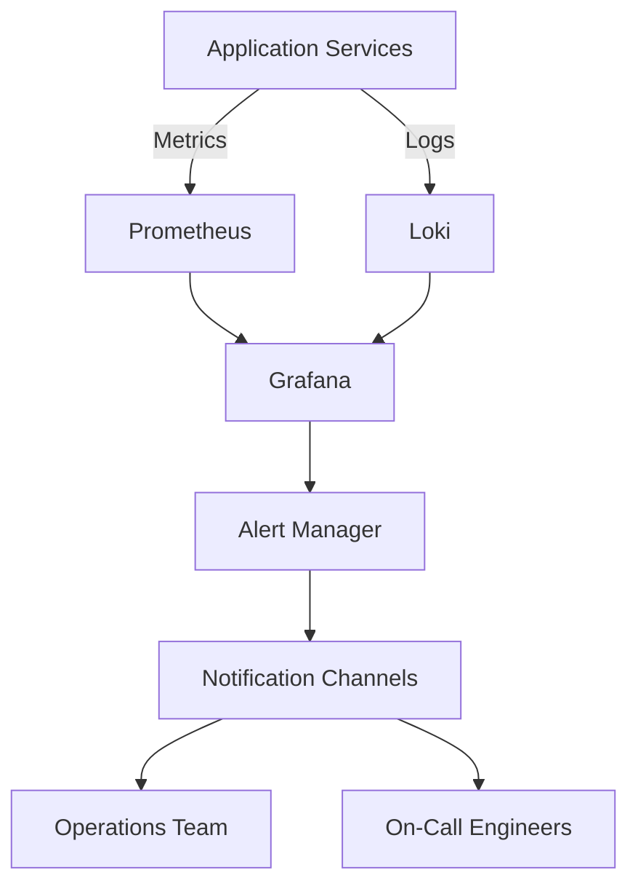
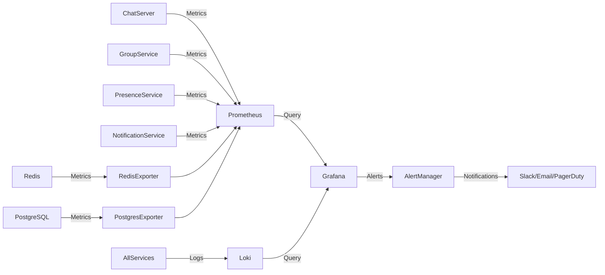
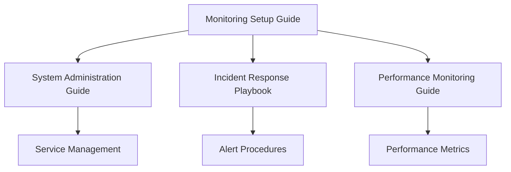

# Monitoring Setup Guide

**Version**: 2025.12.04
**Last Updated**: 2025-12-04
**Status**: Active
**Owner**: Operations Team

## Table of Contents

1. [Introduction](#introduction)
2. [Monitoring Architecture](#monitoring-architecture)
3. [Prometheus Setup](#prometheus-setup)
4. [Grafana Configuration](#grafana-configuration)
5. [Loki Logging Setup](#loki-logging-setup)
6. [Alert Manager Configuration](#alert-manager-configuration)
7. [Metrics and Dashboards](#metrics-and-dashboards)
8. [Log Management](#log-management)
9. [Performance Monitoring](#performance-monitoring)
10. [Troubleshooting](#troubleshooting)
11. [Best Practices](#best-practices)
12. [Cross-References](#cross-references)

## Introduction

This guide provides comprehensive procedures for setting up and managing the monitoring infrastructure for the SilentRelay system. It covers Prometheus metrics collection, Grafana visualization, Loki logging, and alert configuration.

### Scope

This document applies to:
- Monitoring infrastructure setup and maintenance
- Alert configuration and management
- Performance monitoring and analysis
- Log collection and analysis

### Target Audience

- **Primary**: Operations team responsible for monitoring
- **Secondary**: System administrators needing monitoring insights
- **Tertiary**: Development team requiring performance data

## Monitoring Architecture

### High-Level Monitoring Architecture



### Monitoring Components

| Component | Purpose | Technology | Port |
|-----------|---------|------------|------|
| Prometheus | Metrics collection and storage | Prometheus 2.x | 9090 |
| Grafana | Visualization and dashboards | Grafana 9.x | 3000 |
| Loki | Log aggregation and storage | Loki 2.x | 3100 |
| Alert Manager | Alert routing and management | Alertmanager | 9093 |
| Node Exporter | System metrics | Prometheus Exporter | 9100 |
| Redis Exporter | Redis metrics | Prometheus Exporter | 9121 |
| PostgreSQL Exporter | Database metrics | Prometheus Exporter | 9187 |

### Data Flow



## Prometheus Setup

### Prometheus Configuration

The main Prometheus configuration is located at [`infrastructure/prometheus/prometheus.yml`](../infrastructure/prometheus/prometheus.yml).

### Prometheus Configuration File

```yaml
# infrastructure/prometheus/prometheus.yml
global:
  scrape_interval: 15s
  evaluation_interval: 15s

scrape_configs:
  # Prometheus self-monitoring
  - job_name: 'prometheus'
    static_configs:
      - targets: ['localhost:9090']

  # Application services
  - job_name: 'chat-servers'
    static_configs:
      - targets:
          - 'chat-server-1:8080'
          - 'chat-server-2:8080'
    metrics_path: '/metrics'

  # Database monitoring
  - job_name: 'postgres'
    static_configs:
      - targets: ['postgres-exporter:9187']

  # Cache monitoring
  - job_name: 'redis'
    static_configs:
      - targets: ['redis-exporter:9121']

  # Load balancer monitoring
  - job_name: 'haproxy'
    static_configs:
      - targets: ['loadbalancer:8404']
    metrics_path: '/stats'
    params:
      format: ['prometheus']
```

### Prometheus Setup Procedure

1. **Start Prometheus service**
   ```bash
   docker-compose up -d prometheus
   ```

2. **Verify Prometheus is running**
   ```bash
   docker-compose logs prometheus
   curl http://localhost:9090/-/healthy
   ```

3. **Check target discovery**
   ```bash
   curl http://localhost:9090/api/v1/targets
   ```

### Prometheus Query Examples

```promql
# Check active WebSocket connections
sum(messenger_websocket_connections)

# Check message rate
rate(messenger_messages_total[5m])

# Check HTTP error rate
rate(messenger_http_requests_total{status=~"5.."}[5m])

# Check database connection pool
messenger_prekeys_remaining
```

## Grafana Configuration

### Grafana Setup

1. **Start Grafana service**
   ```bash
   docker-compose up -d grafana
   ```

2. **Access Grafana web interface**
   ```
   http://localhost:3000
   Default credentials: admin/admin
   ```

3. **Configure data sources**
   - Prometheus: `http://prometheus:9090`
   - Loki: `http://loki:3100`

### Grafana Configuration File

```yaml
# infrastructure/grafana/provisioning/datasources/datasources.yml
apiVersion: 1

datasources:
  - name: Prometheus
    type: prometheus
    access: proxy
    url: http://prometheus:9090
    isDefault: true

  - name: Loki
    type: loki
    access: proxy
    url: http://loki:3100
```

### Essential Dashboards

#### System Overview Dashboard

```json
{
  "title": "System Overview",
  "panels": [
    {
      "title": "Service Health",
      "type": "stat",
      "targets": [
        {
          "expr": "up",
          "legendFormat": "{{job}}"
        }
      ]
    },
    {
      "title": "Message Rate",
      "type": "graph",
      "targets": [
        {
          "expr": "rate(messenger_messages_total[5m])",
          "legendFormat": "Messages/s"
        }
      ]
    }
  ]
}
```

#### Performance Dashboard

```json
{
  "title": "Performance Metrics",
  "panels": [
    {
      "title": "HTTP Response Times",
      "type": "graph",
      "targets": [
        {
          "expr": "histogram_quantile(0.95, sum(rate(messenger_http_request_duration_seconds_bucket[5m])) by (le))",
          "legendFormat": "95th Percentile"
        }
      ]
    },
    {
      "title": "WebSocket Latency",
      "type": "graph",
      "targets": [
        {
          "expr": "histogram_quantile(0.95, sum(rate(messenger_message_delivery_latency_seconds_bucket[5m])) by (le))",
          "legendFormat": "95th Percentile"
        }
      ]
    }
  ]
}
```

## Loki Logging Setup

### Loki Configuration

1. **Start Loki service**
   ```bash
   docker-compose up -d loki
   ```

2. **Configure log collection**
   ```yaml
   # Add to docker-compose.yml services
   logging:
     driver: loki
     options:
       loki-url: "http://loki:3100/loki/api/v1/push"
   ```

### Log Query Examples

```logql
# Find error logs
{job="chat-server"} |= "error"

# Find authentication failures
{job="chat-server"} | json | auth_result="failure"

# Find rate limit hits
{job="chat-server"} | json | rate_limit="hit"
```

### Log Retention Policy

```yaml
# Loki configuration (example)
auth_enabled: false

server:
  http_listen_port: 3100

ingester:
  lifecycler:
    ring:
      kvstore:
        store: inmemory
      replication_factor: 1
    final_sleep: 0s
  chunk_idle_period: 5m
  chunk_retain_period: 30s

schema_config:
  configs:
    - from: 2020-10-24
      store: boltdb-shipper
      object_store: filesystem
      schema: v11
      index:
        prefix: index_
        period: 24h

storage_config:
  boltdb_shipper:
    active_index_directory: /loki/boltdb-shipper-active
    cache_location: /loki/boltdb-shipper-cache
    shared_store: filesystem
  filesystem:
    directory: /loki/chunks

limits_config:
  retention_period: 30d
  retention_stream:
    - selector: '{job=~".+"}'
      priority: 1
      period: 7d
```

## Alert Manager Configuration

### Alert Rules Configuration

```yaml
# infrastructure/prometheus/alert.rules.yml
groups:
- name: system-alerts
  rules:
  - alert: HighErrorRate
    expr: rate(messenger_http_requests_total{status=~"5.."}[5m]) > 0.1
    for: 5m
    labels:
      severity: critical
    annotations:
      summary: "High error rate on {{ $labels.job }}"
      description: "Error rate is {{ $value }} errors per second"

  - alert: HighMessageLatency
    expr: histogram_quantile(0.95, sum(rate(messenger_message_delivery_latency_seconds_bucket[5m])) by (le)) > 2
    for: 10m
    labels:
      severity: warning
    annotations:
      summary: "High message delivery latency"
      description: "95th percentile latency is {{ $value }} seconds"

  - alert: DatabaseConnectionIssues
    expr: rate(pg_stat_activity_count{state="active"}[5m]) < 5
    for: 5m
    labels:
      severity: critical
    annotations:
      summary: "Low database activity"
      description: "Database may be experiencing issues"
```

### Alert Manager Configuration

```yaml
# infrastructure/prometheus/alertmanager.yml
global:
  resolve_timeout: 5m

route:
  group_by: ['alertname', 'severity']
  group_wait: 30s
  group_interval: 5m
  repeat_interval: 3h
  receiver: 'default-receiver'

receivers:
- name: 'default-receiver'
  slack_configs:
  - api_url: 'https://hooks.slack.com/services/XXX/YYY/ZZZ'
    channel: '#alerts'
    send_resolved: true
  email_configs:
  - to: 'ops-team@example.com'
    from: 'alertmanager@example.com'
    smarthost: 'smtp.example.com:587'
    auth_username: 'alertmanager@example.com'
    auth_password: 'password'
```

### Alert Setup Procedure

1. **Configure alert rules**
   ```bash
   # Add alert rules file to Prometheus
   vim infrastructure/prometheus/alert.rules.yml

   # Update prometheus.yml to include rules
   vim infrastructure/prometheus/prometheus.yml
   ```

2. **Restart Prometheus**
   ```bash
   docker-compose restart prometheus
   ```

3. **Test alerts**
   ```bash
   # Check active alerts
   curl http://localhost:9090/api/v1/alerts

   # Check alertmanager status
   curl http://localhost:9093/-/healthy
   ```

## Metrics and Dashboards

### Key Metrics to Monitor

| Metric | Description | Threshold |
|--------|-------------|-----------|
| `messenger_websocket_connections` | Active WebSocket connections | > 1000 |
| `messenger_messages_total` | Message rate | > 100/s |
| `messenger_http_requests_total{status="5xx"}` | Error rate | < 1% |
| `messenger_message_delivery_latency_seconds` | Delivery latency | < 1s (95th) |
| `messenger_prekeys_remaining` | Available pre-keys | > 20/user |
| `pg_stat_activity_count` | Database connections | > 10 active |
| `redis_memory_used_bytes` | Redis memory usage | < 80% |
| `rate(container_cpu_usage_seconds_total[5m])` | CPU usage | < 80% |

### Dashboard Creation Guide

1. **Create new dashboard**
   - Navigate to Grafana: `http://localhost:3000`
   - Click "Create" → "Dashboard"

2. **Add Prometheus data source**
   - Select "Prometheus" as data source
   - Enter query in PromQL format

3. **Add visualization panels**
   - Time series for trends
   - Gauges for current values
   - Tables for detailed data
   - Alerts for threshold monitoring

4. **Save and share dashboard**
   - Set appropriate name and tags
   - Save to appropriate folder
   - Set refresh interval

## Log Management

### Log Collection Setup

1. **Configure service logging**
   ```yaml
   # In docker-compose.yml
   services:
     chat-server:
       logging:
         driver: loki
         options:
           loki-url: "http://loki:3100/loki/api/v1/push"
           max-size: "10m"
           max-file: "3"
   ```

2. **Configure log rotation**
   ```bash
   # Set up logrotate for host logs
   cat > /etc/logrotate.d/messenger <<EOF
   /var/log/messenger/*.log {
       daily
       rotate 7
       compress
       delaycompress
       missingok
       notifempty
       create 0640 root adm
   }
   EOF
   ```

### Log Analysis Procedures

1. **Real-time log monitoring**
   ```bash
   # Follow logs in real-time
   docker-compose logs -f chat-server

   # Filter for errors
   docker-compose logs chat-server | grep ERROR
   ```

2. **Historical log analysis**
   ```logql
   # Query historical logs in Loki
   {job="chat-server"} |= "authentication" | json | time > now() - 1h
   ```

3. **Log-based alerting**
   ```yaml
   # Add to alert rules
   - alert: AuthenticationFailures
     expr: sum(rate({job="chat-server"} | json | auth_result="failure" [5m])) > 5
     for: 5m
     labels:
       severity: warning
     annotations:
       summary: "High authentication failure rate"
   ```

## Performance Monitoring

### Performance Metrics

| Category | Metrics | Target |
|----------|---------|-------|
| **Message Delivery** | `messenger_message_delivery_latency_seconds` | < 500ms |
| **WebSocket** | `messenger_websocket_connections` | > 95% uptime |
| **HTTP API** | `messenger_http_request_duration_seconds` | < 200ms (95th) |
| **Database** | `pg_stat_activity_count` | < 10ms query time |
| **Cache** | `redis_commands_duration_seconds` | < 5ms operations |
| **System** | `node_cpu_seconds_total` | < 70% utilization |

### Performance Baseline

```promql
# CPU Usage Baseline
avg(rate(node_cpu_seconds_total{mode="idle"}[5m])) by (instance) * 100

# Memory Usage Baseline
(node_memory_MemTotal_bytes - node_memory_MemAvailable_bytes) / node_memory_MemTotal_bytes * 100

# Network Latency Baseline
histogram_quantile(0.95, sum(rate(messenger_message_delivery_latency_seconds_bucket[5m])) by (le))
```

### Performance Alerting

```yaml
# Performance alert rules
- alert: HighCPUUsage
  expr: 100 - (avg(rate(node_cpu_seconds_total{mode="idle"}[5m])) by (instance) * 100) > 80
  for: 15m
  labels:
    severity: warning
  annotations:
    summary: "High CPU usage on {{ $labels.instance }}"

- alert: HighMemoryUsage
  expr: (node_memory_MemTotal_bytes - node_memory_MemAvailable_bytes) / node_memory_MemTotal_bytes * 100 > 85
  for: 15m
  labels:
    severity: warning
  annotations:
    summary: "High memory usage on {{ $labels.instance }}"

- alert: HighMessageLatency
  expr: histogram_quantile(0.95, sum(rate(messenger_message_delivery_latency_seconds_bucket[5m])) by (le)) > 1
  for: 10m
  labels:
    severity: critical
  annotations:
    summary: "High message delivery latency"
```

## Troubleshooting

### Common Monitoring Issues

| Issue | Symptom | Solution |
|-------|---------|----------|
| No metrics in Prometheus | Targets show as "down" | Check service health and network connectivity |
| Missing logs in Loki | No logs appearing | Verify log collection configuration |
| Alerts not firing | Expected alerts missing | Check alert rules and evaluation |
| Dashboard errors | "No data" in panels | Verify Prometheus data source connection |
| High latency | Slow query responses | Check database and network performance |

### Diagnostic Procedures

1. **Check Prometheus targets**
   ```bash
   curl http://localhost:9090/api/v1/targets
   ```

2. **Test Prometheus queries**
   ```bash
   curl -G 'http://localhost:9090/api/v1/query' --data-urlencode 'query=up'
   ```

3. **Check Loki log ingestion**
   ```bash
   curl http://localhost:3100/ready
   ```

4. **Test alert rules**
   ```bash
   curl http://localhost:9090/api/v1/rules
   ```

## Best Practices

### Monitoring Best Practices

1. **Alert Configuration**
   - Set appropriate thresholds based on baselines
   - Use multiple severity levels (info, warning, critical)
   - Include meaningful annotations and runbooks

2. **Dashboard Design**
   - Organize by service and function
   - Use consistent naming conventions
   - Include time range selectors
   - Add descriptive panel titles

3. **Log Management**
   - Implement log rotation policies
   - Use structured logging (JSON format)
   - Set appropriate retention periods
   - Monitor log volume growth

4. **Performance Monitoring**
   - Establish performance baselines
   - Monitor trends over time
   - Set alerts for significant deviations
   - Regularly review and update thresholds

### Operational Excellence

1. **Documentation**
   - Document all monitoring setup procedures
   - Maintain runbooks for common alert scenarios
   - Keep dashboard documentation updated

2. **Training**
   - Train team on monitoring tools and procedures
   - Conduct regular alert response drills
   - Review monitoring effectiveness quarterly

3. **Continuous Improvement**
   - Regularly review alert effectiveness
   - Update dashboards based on operational needs
   - Add new metrics as system evolves
   - Optimize query performance

## Cross-References

### Related Documentation

- [System Administration Guide](SYSTEM_ADMINISTRATION_GUIDE.md) - System setup and management
- [Incident Response Playbook](INCIDENT_RESPONSE_PLAYBOOK.md) - Alert response procedures
- [Maintenance Procedures](MAINTENANCE_PROCEDURES.md) - Scheduled maintenance tasks
- [Performance Monitoring Guide](PERFORMANCE_MONITORING_GUIDE.md) - Performance optimization
- [Backup Strategy Guide](BACKUP_STRATEGY_GUIDE.md) - Data protection monitoring

### Configuration Files

- [`infrastructure/prometheus/prometheus.yml`](../infrastructure/prometheus/prometheus.yml) - Prometheus configuration
- [`infrastructure/grafana/provisioning/datasources/datasources.yml`](../infrastructure/grafana/provisioning/datasources/datasources.yml) - Grafana data sources
- [`infrastructure/prometheus/alert.rules.yml`](../infrastructure/prometheus/alert.rules.yml) - Alert rules
- [`internal/metrics/metrics.go`](../internal/metrics/metrics.go) - Metrics collection implementation

### Monitoring Tools

- **Prometheus**: Metrics collection and alerting
- **Grafana**: Visualization and dashboards
- **Loki**: Log aggregation and analysis
- **Alert Manager**: Alert routing and notification

### Monitoring Workflows

1. **System Monitoring**: Refer to [System Administration Guide](SYSTEM_ADMINISTRATION_GUIDE.md#service-management) for service health checks
2. **Performance Monitoring**: See [Performance Monitoring Guide](PERFORMANCE_MONITORING_GUIDE.md#key-performance-metrics) for performance metrics
3. **Incident Detection**: Use [Incident Response Playbook](INCIDENT_RESPONSE_PLAYBOOK.md#detection-and-triage) for incident identification
4. **Backup Monitoring**: Consult [Backup Strategy Guide](BACKUP_STRATEGY_GUIDE.md#backup-monitoring) for backup health checks

### Quick Reference

| Task | Documentation | Tools |
|------|---------------|-------|
| Metrics setup | [Prometheus Setup](#prometheus-setup) | `curl http://localhost:9090` |
| Alert configuration | [Alert Manager Configuration](#alert-manager-configuration) | `curl http://localhost:9093` |
| Dashboard creation | [Grafana Configuration](#grafana-configuration) | `http://localhost:3000` |
| Log analysis | [Log Management](#log-management) | `docker-compose logs -f` |
| Performance alerts | [Performance Monitoring](#performance-monitoring) | Prometheus alerts |
| Incident detection | [Incident Response Playbook](INCIDENT_RESPONSE_PLAYBOOK.md) | Security dashboard |

### Documentation Navigation



### Cross-Document References

- **System Administration**: For service management procedures, see [System Administration Guide](SYSTEM_ADMINISTRATION_GUIDE.md#service-management)
- **Incident Response**: Alert handling procedures in [Incident Response Playbook](INCIDENT_RESPONSE_PLAYBOOK.md#incident-response-procedures)
- **Performance Optimization**: Performance monitoring techniques in [Performance Monitoring Guide](PERFORMANCE_MONITORING_GUIDE.md#performance-monitoring)
- **Backup Monitoring**: Backup verification procedures in [Backup Strategy Guide](BACKUP_STRATEGY_GUIDE.md#backup-verification)
- **Security Monitoring**: Security event monitoring in [Intrusion Detection System Documentation](../INTRUSION_DETECTION_SYSTEM.md)

## Change Log

| Version | Date | Changes | Author |
|---------|------|---------|--------|
| 2025.12.04 | 2025-12-04 | Initial document creation | Operations Team |
| | | Added Prometheus setup procedures | |
| | | Added Grafana configuration guide | |
| | | Added alert management procedures | |

## Next Steps

1. **Review** monitoring configuration and alert thresholds
2. **Test** all alert rules in staging environment
3. **Create** essential dashboards for all services
4. **Document** any additional monitoring requirements

This Monitoring Setup Guide provides comprehensive procedures for establishing and maintaining the monitoring infrastructure. Refer to the [Operational Documentation Index](OPERATIONAL_DOCUMENTATION_INDEX.md) for the complete documentation suite.