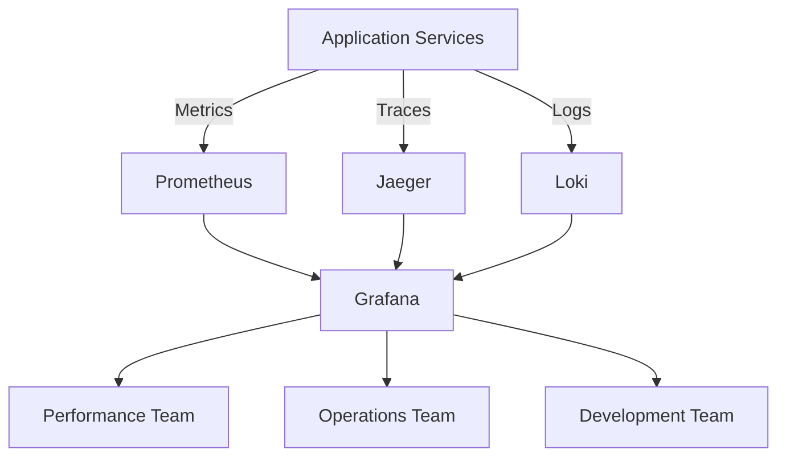
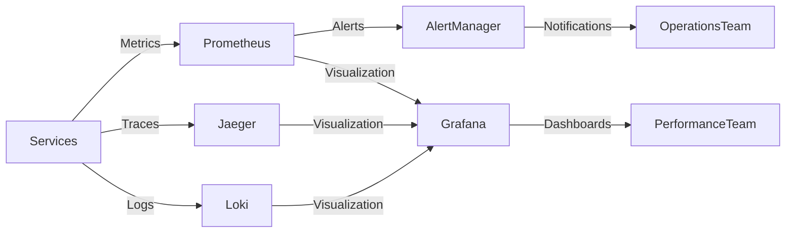

# Performance Monitoring Guide

**Version**: 2025.12.04
**Last Updated**: 2025-12-04
**Status**: Active
**Owner**: Performance Engineering Team

## Table of Contents

1. [Introduction](#introduction)
2. [Performance Architecture](#performance-architecture)
3. [Key Performance Metrics](#key-performance-metrics)
4. [Performance Monitoring Setup](#performance-monitoring-setup)
5. [Database Optimization](#database-optimization)
6. [Application Performance](#application-performance)
7. [Network Performance](#network-performance)
8. [Caching Strategies](#caching-strategies)
9. [Load Testing Procedures](#load-testing-procedures)
10. [Performance Tuning](#performance-tuning)
11. [Capacity Planning](#capacity-planning)
12. [Best Practices](#best-practices)
13. [Cross-References](#cross-references)

## Introduction

This Performance Monitoring Guide provides comprehensive procedures for monitoring, analyzing, and optimizing the performance of the SilentRelay system. It establishes a framework for continuous performance improvement and capacity management.

### Scope

This document applies to:
- Performance monitoring and analysis
- Database optimization procedures
- Application performance tuning
- Network performance management
- Capacity planning and scaling
- Load testing and benchmarking

### Target Audience

- **Primary**: Performance engineering team
- **Secondary**: Operations team managing system performance
- **Tertiary**: Development team requiring performance insights

## Performance Architecture

### Performance Monitoring Stack



### Performance Components

| Component | Metrics Collected | Monitoring Tool | Frequency |
|-----------|-------------------|------------------|-----------|
| Chat Server | Response time, throughput, errors | Prometheus | Continuous |
| Database | Query performance, connections | Prometheus + pgBadger | Continuous |
| Cache | Hit rate, latency, memory | Prometheus | Continuous |
| Network | Latency, bandwidth, errors | Prometheus | Continuous |
| Media Storage | Transfer speed, errors | Prometheus | Continuous |
| WebSocket | Connection stability, latency | Prometheus | Continuous |

### Performance Data Flow



## Key Performance Metrics

### Core Performance Metrics

| Category | Metric | Target | Alert Threshold |
|-----------|--------|-------|-----------------|
| **Message Delivery** | `messenger_message_delivery_latency_seconds` | < 500ms | > 1s for 5m |
| **WebSocket** | `messenger_websocket_connections` | > 95% uptime | < 90% for 15m |
| **HTTP API** | `messenger_http_request_duration_seconds` | < 200ms (95th) | > 500ms for 10m |
| **Database** | `pg_stat_activity_count` | < 10ms query time | > 50ms for 15m |
| **Cache** | `redis_commands_duration_seconds` | < 5ms operations | > 20ms for 10m |
| **System** | `node_cpu_seconds_total` | < 70% utilization | > 85% for 15m |
| **Memory** | `node_memory_MemAvailable_bytes` | > 20% free | < 10% for 10m |
| **Network** | `node_network_receive_bytes_total` | Baseline + 20% | 2x baseline for 5m |

### Performance Baselines

```promql
# CPU Usage Baseline
avg(rate(node_cpu_seconds_total{mode="idle"}[5m])) by (instance) * 100

# Memory Usage Baseline
(node_memory_MemTotal_bytes - node_memory_MemAvailable_bytes) / node_memory_MemTotal_bytes * 100

# Network Latency Baseline
histogram_quantile(0.95, sum(rate(messenger_message_delivery_latency_seconds_bucket[5m])) by (le))
```

## Performance Monitoring Setup

### Prometheus Performance Configuration

```yaml
# Add to prometheus.yml
scrape_configs:
  - job_name: 'performance-metrics'
    scrape_interval: 5s
    metrics_path: '/metrics'
    static_configs:
      - targets:
          - 'chat-server:8080'
          - 'group-service:8083'
          - 'presence-service:8081'
          - 'notification-service:8082'
```

### Performance Alert Rules

```yaml
# infrastructure/prometheus/performance-alerts.yml
groups:
- name: performance-alerts
  rules:
  - alert: HighMessageLatency
    expr: histogram_quantile(0.95, sum(rate(messenger_message_delivery_latency_seconds_bucket[5m])) by (le)) > 1
    for: 10m
    labels:
      severity: warning
    annotations:
      summary: "High message delivery latency"
      description: "95th percentile latency is {{ $value }} seconds"

  - alert: HighDatabaseLatency
    expr: pg_stat_activity_max_duration_seconds > 0.5
    for: 15m
    labels:
      severity: critical
    annotations:
      summary: "High database query latency"
      description: "Max query duration is {{ $value }} seconds"

  - alert: HighCPUUsage
    expr: 100 - (avg(rate(node_cpu_seconds_total{mode="idle"}[5m])) by (instance) * 100) > 80
    for: 15m
    labels:
      severity: warning
    annotations:
      summary: "High CPU usage on {{ $labels.instance }}"
```

### Performance Dashboard Setup

```json
{
  "title": "Performance Overview",
  "panels": [
    {
      "title": "System Resource Utilization",
      "type": "graph",
      "targets": [
        {
          "expr": "100 - (avg(rate(node_cpu_seconds_total{mode=\"idle\"}[5m])) by (instance) * 100)",
          "legendFormat": "CPU Usage - {{instance}}"
        },
        {
          "expr": "(node_memory_MemTotal_bytes - node_memory_MemAvailable_bytes) / node_memory_MemTotal_bytes * 100",
          "legendFormat": "Memory Usage - {{instance}}"
        }
      ]
    },
    {
      "title": "Message Delivery Performance",
      "type": "graph",
      "targets": [
        {
          "expr": "histogram_quantile(0.95, sum(rate(messenger_message_delivery_latency_seconds_bucket[5m])) by (le))",
          "legendFormat": "95th Percentile Latency"
        },
        {
          "expr": "histogram_quantile(0.5, sum(rate(messenger_message_delivery_latency_seconds_bucket[5m])) by (le))",
          "legendFormat": "Median Latency"
        }
      ]
    }
  ]
}
```

## Database Optimization

Database optimization procedures have been moved to a dedicated guide for better organization and detail.

**See: [Database Optimization Guide](DATABASE_OPTIMIZATION_GUIDE.md)**

This guide covers:
- Query performance analysis and optimization
- Index management and maintenance
- Connection pooling configuration
- Database performance monitoring and alerts
- Best practices for PostgreSQL optimization

## Application Performance

### Application Performance Metrics

```promql
# WebSocket performance
rate(messenger_websocket_messages_total[5m])
histogram_quantile(0.95, sum(rate(messenger_websocket_latency_seconds_bucket[5m])) by (le))

# HTTP API performance
rate(messenger_http_requests_total[5m])
histogram_quantile(0.95, sum(rate(messenger_http_request_duration_seconds_bucket[5m])) by (le))

# Message processing
rate(messenger_messages_total[5m])
messenger_offline_messages_queued
```

### Application Optimization Techniques

1. **Caching Strategies**
   ```go
   // Implement Redis caching
   func getCachedUser(userID string) (*User, error) {
       // Check cache first
       cached, err := redisClient.Get(ctx, "user:"+userID).Result()
       if err == nil {
           var user User
           json.Unmarshal([]byte(cached), &user)
           return &user, nil
       }

       // Cache miss - fetch from database
       user, err := db.GetUser(userID)
       if err != nil {
           return nil, err
       }

       // Cache for future requests
       cacheData, _ := json.Marshal(user)
       redisClient.Set(ctx, "user:"+userID, cacheData, 5*time.Minute)

       return user, nil
   }
   ```

2. **Connection Pooling**
   ```go
   // Configure database connection pool
   db, err := sql.Open("postgres", postgresURL)
   if err != nil {
       log.Fatal(err)
   }

   db.SetMaxOpenConns(50)
   db.SetMaxIdleConns(25)
   db.SetConnMaxLifetime(30 * time.Minute)
   ```

### Application Performance Alerts

```yaml
- alert: HighErrorRate
  expr: rate(messenger_http_requests_total{status=~"5.."}[5m]) / rate(messenger_http_requests_total[5m]) > 0.05
  for: 10m
  labels:
    severity: critical
  annotations:
    summary: "High error rate detected"
    description: "Error rate is {{ $value }}%"

- alert: HighWebSocketLatency
  expr: histogram_quantile(0.95, sum(rate(messenger_websocket_latency_seconds_bucket[5m])) by (le)) > 0.5
  for: 15m
  labels:
    severity: warning
  annotations:
    summary: "High WebSocket latency"
    description: "95th percentile latency is {{ $value }} seconds"
```

## Network Performance

### Network Monitoring

```promql
# Network bandwidth
rate(node_network_receive_bytes_total[5m])
rate(node_network_transmit_bytes_total[5m])

# Network errors
rate(node_network_receive_errs_total[5m])
rate(node_network_transmit_errs_total[5m])

# Connection metrics
node_sockstat_TCP_inuse
node_sockstat_TCP_alloc
```

### Network Optimization

1. **TCP Optimization**
   ```bash
   # Optimize TCP settings
   sysctl -w net.core.somaxconn=4096
   sysctl -w net.ipv4.tcp_max_syn_backlog=4096
   sysctl -w net.ipv4.tcp_keepalive_time=60
   sysctl -w net.ipv4.tcp_fin_timeout=30
   ```

2. **WebSocket Optimization**
   ```go
   // Configure WebSocket server
   server := &http.Server{
       ReadTimeout:  30 * time.Second,
       WriteTimeout: 30 * time.Second,
       IdleTimeout:  120 * time.Second,
       MaxHeaderBytes: 1 << 20,
   }

   // Configure WebSocket upgrader
   upgrader := websocket.Upgrader{
       ReadBufferSize:  1024,
       WriteBufferSize: 1024,
       HandshakeTimeout: 5 * time.Second,
       EnableCompression: true,
   }
   ```

### Network Performance Alerts

```yaml
- alert: HighNetworkLatency
  expr: histogram_quantile(0.95, sum(rate(messenger_message_delivery_latency_seconds_bucket[5m])) by (le)) > 1
  for: 15m
  labels:
    severity: warning
  annotations:
    summary: "High network latency detected"
    description: "Message delivery latency is {{ $value }} seconds"

- alert: NetworkErrors
  expr: rate(node_network_receive_errs_total[5m]) > 0.1
  for: 5m
  labels:
    severity: critical
  annotations:
    summary: "High network error rate"
    description: "Network error rate is {{ $value }} errors per second"
```

## Caching Strategies

### Cache Performance Monitoring

```promql
# Redis performance
redis_commands_duration_seconds
redis_commands_total
redis_memory_used_bytes
redis_keyspace_hits
redis_keyspace_misses

# Cache hit ratio
redis_keyspace_hits / (redis_keyspace_hits + redis_keyspace_misses)
```

### Cache Optimization

1. **Cache Configuration**
   ```go
   // Configure Redis client
   rdb := redis.NewClient(&redis.Options{
       Addr:     "redis:6379",
       Password: "", // no password set
       DB:       0,  // use default DB
       PoolSize: 100,
       MinIdleConns: 50,
       DialTimeout:  5 * time.Second,
       ReadTimeout:  3 * time.Second,
       WriteTimeout: 3 * time.Second,
       PoolTimeout:  4 * time.Second,
   })
   ```

2. **Cache Invalidation**
   ```go
   // Implement cache invalidation
   func invalidateUserCache(userID string) {
       // Invalidate user data cache
       redisClient.Del(ctx, "user:"+userID)

       // Invalidate related caches
       redisClient.Del(ctx, "user:presence:"+userID)
       redisClient.Del(ctx, "user:devices:"+userID)
   }
   ```

### Cache Performance Alerts

```yaml
- alert: LowCacheHitRatio
  expr: redis_keyspace_hits / (redis_keyspace_hits + redis_keyspace_misses) < 0.7
  for: 30m
  labels:
    severity: warning
  annotations:
    summary: "Low cache hit ratio"
    description: "Cache hit ratio is {{ $value }}"

- alert: HighCacheMemory
  expr: redis_memory_used_bytes / redis_memory_max_bytes > 0.85
  for: 15m
  labels:
    severity: warning
  annotations:
    summary: "High cache memory usage"
    description: "Cache memory usage is {{ $value }}%"
```

## Load Testing Procedures

### Load Testing Setup

1. **Load Test Configuration**
   ```yaml
   # loadtest-config.yml
   scenarios:
     - name: "Chat Load Test"
       flow:
         - connect: "ws://localhost:8080/ws"
         - send: '{"type":"auth","token":"test-token"}'
         - think: 2
         - send: '{"type":"message","content":"test message"}'
         - think: 5
         - disconnect: ""
   ```

2. **Load Test Execution**
   ```bash
   # Run load test
   k6 run --vus 1000 --duration 30m loadtest-config.yml

   # Run distributed load test
   k6 cloud loadtest-config.yml
   ```

### Load Test Analysis

```promql
# Load test metrics
k6_http_req_duration{scenario="Chat Load Test"}
k6_http_reqs{scenario="Chat Load Test"}
k6_checks{scenario="Chat Load Test"}

# Performance under load
histogram_quantile(0.95, sum(rate(messenger_message_delivery_latency_seconds_bucket[5m])) by (le))
```

## Performance Tuning

### Performance Tuning Procedures

1. **Database Tuning**
   ```sql
   -- Optimize PostgreSQL configuration
   ALTER SYSTEM SET shared_buffers = '4GB';
   ALTER SYSTEM SET effective_cache_size = '12GB';
   ALTER SYSTEM SET maintenance_work_mem = '1GB';
   ALTER SYSTEM SET work_mem = '64MB';
   ALTER SYSTEM SET random_page_cost = 1.1;
   ALTER SYSTEM SET effective_io_concurrency = 200;
   ```

2. **Application Tuning**
   ```go
   // Optimize Go runtime
   func init() {
       runtime.GOMAXPROCS(runtime.NumCPU())
       debug.SetGCPercent(50)
       debug.SetMemoryLimit(8 * 1024 * 1024 * 1024) // 8GB
   }
   ```

### Performance Tuning Checklist

```markdown
**Database Tuning**:
- [ ] Optimize shared_buffers based on available memory
- [ ] Set appropriate work_mem for complex queries
- [ ] Configure maintenance_work_mem for vacuum operations
- [ ] Adjust random_page_cost based on storage type
- [ ] Set effective_io_concurrency for SSD storage

**Application Tuning**:
- [ ] Configure GOMAXPROCS for optimal concurrency
- [ ] Set appropriate garbage collection parameters
- [ ] Optimize connection pool sizes
- [ ] Configure appropriate timeouts
- [ ] Set memory limits based on container size

**System Tuning**:
- [ ] Optimize kernel parameters for network performance
- [ ] Configure appropriate file descriptor limits
- [ ] Set optimal TCP parameters
- [ ] Configure swap settings appropriately
- [ ] Optimize I/O scheduler for workload
```

## Capacity Planning

### Capacity Planning Metrics

```promql
# User growth trends
sum(increase(messenger_messages_total[7d])) / sum(increase(messenger_messages_total[30d]))

# Resource utilization trends
avg(rate(node_cpu_seconds_total{mode="idle"}[30d])) by (instance)
avg((node_memory_MemTotal_bytes - node_memory_MemAvailable_bytes) / node_memory_MemTotal_bytes * 100[30d]) by (instance)

# Storage growth
sum(increase(minio_bucket_usage_bytes[7d])) / sum(increase(minio_bucket_usage_bytes[30d]))
```

### Capacity Planning Procedures

1. **Resource Forecasting**
   ```markdown
   **Forecasting Methodology**:
   - Analyze 30-day trends
   - Project 90-day requirements
   - Plan for peak usage (2x average)
   - Include buffer for unexpected growth

   **Capacity Planning Template**:
   | Resource | Current Usage | 30-Day Trend | 90-Day Projection | Required Capacity |
   |----------|---------------|-------------|------------------|-------------------|
   | CPU | 40% | +5%/month | 55% | 8 cores |
   | Memory | 60% | +3%/month | 70% | 16GB |
   | Storage | 400GB | +20GB/month | 500GB | 1TB |
   | Connections | 5000 | +200/month | 6000 | 10000 |
   ```

2. **Scaling Procedures**
   ```bash
   # Horizontal scaling
   docker-compose up -d --scale chat-server=5

   # Vertical scaling
   docker update --cpus 2 --memory 4g chat-server

   # Database scaling
   pgpool -n -f /etc/pgpool.conf
   ```

### Capacity Alerts

```yaml
- alert: HighCapacityUsage
  expr: (node_memory_MemTotal_bytes - node_memory_MemAvailable_bytes) / node_memory_MemTotal_bytes * 100 > 75
  for: 1h
  labels:
    severity: warning
  annotations:
    summary: "High memory capacity usage"
    description: "Memory usage is {{ $value }}%"

- alert: StorageGrowth
  expr: predict_linear(minio_bucket_usage_bytes[7d], 30 * 24 * 3600) > 0.9 * minio_bucket_capacity_bytes
  for: 1h
  labels:
    severity: warning
  annotations:
    summary: "Rapid storage growth detected"
    description: "Storage projected to reach {{ $value }}% capacity in 30 days"
```

## Best Practices

### Performance Monitoring Best Practices

1. **Comprehensive Monitoring**
   - Monitor all critical performance metrics
   - Set appropriate baselines and thresholds
   - Implement multi-level alerting
   - Maintain historical performance data

2. **Proactive Optimization**
   - Regularly review performance trends
   - Conduct periodic load testing
   - Optimize before reaching capacity limits
   - Document all optimization activities

3. **Continuous Improvement**
   - Regularly update performance baselines
   - Review and update alert thresholds
   - Incorporate new metrics as system evolves
   - Share performance insights across teams

### Performance Optimization Tips

1. **Database Optimization**
   - Regularly vacuum and analyze tables
   - Monitor and optimize slow queries
   - Maintain appropriate connection pool sizes
   - Use prepared statements for frequent queries

2. **Application Optimization**
   - Implement effective caching strategies
   - Optimize connection management
   - Use appropriate concurrency patterns
   - Minimize memory allocations

3. **System Optimization**
   - Monitor and optimize resource usage
   - Configure appropriate kernel parameters
   - Implement effective load balancing
   - Plan for gradual capacity increases

## Cross-References

### Related Documentation

- [Database Optimization Guide](DATABASE_OPTIMIZATION_GUIDE.md) - Database performance optimization
- [System Administration Guide](SYSTEM_ADMINISTRATION_GUIDE.md) - System management
- [Monitoring Setup Guide](MONITORING_SETUP_GUIDE.md) - Monitoring infrastructure
- [Maintenance Procedures](MAINTENANCE_PROCEDURES.md) - Maintenance tasks
- [Incident Response Playbook](INCIDENT_RESPONSE_PLAYBOOK.md) - Incident procedures

### Configuration Files

- [`internal/metrics/metrics.go`](../internal/metrics/metrics.go) - Metrics collection
- [`infrastructure/prometheus/prometheus.yml`](../infrastructure/prometheus/prometheus.yml) - Monitoring setup
- [`internal/config/config.go`](../internal/config/config.go) - Application configuration

### Performance Tools

- **Monitoring**: Prometheus, Grafana, Loki
- **Tracing**: Jaeger, OpenTelemetry
- **Load Testing**: k6, Locust
- **Profiling**: pprof, Go trace

## Change Log

| Version | Date | Changes | Author |
|---------|------|---------|--------|
| 2025.12.04 | 2025-12-04 | Initial document creation | Performance Team |
| | | Added comprehensive performance metrics | |
| | | Added optimization procedures | |
| | | Added capacity planning framework | |

## Next Steps

1. **Review** performance monitoring setup
2. **Test** all performance optimization procedures
3. **Document** any additional performance requirements
4. **Integrate** with monitoring and alerting systems

This Performance Monitoring Guide provides comprehensive procedures for performance optimization and capacity management. Refer to the [Operational Documentation Index](OPERATIONAL_DOCUMENTATION_INDEX.md) for the complete documentation suite.