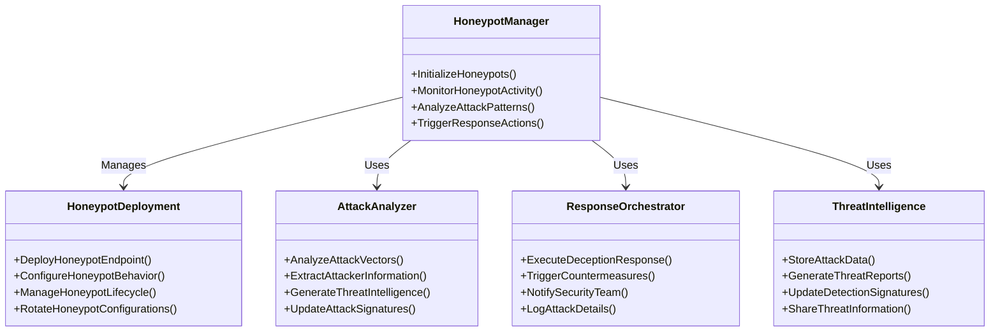
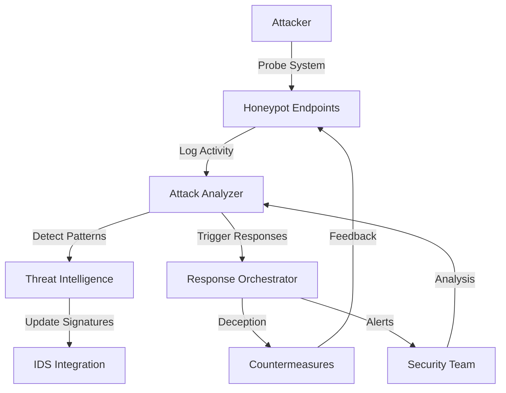
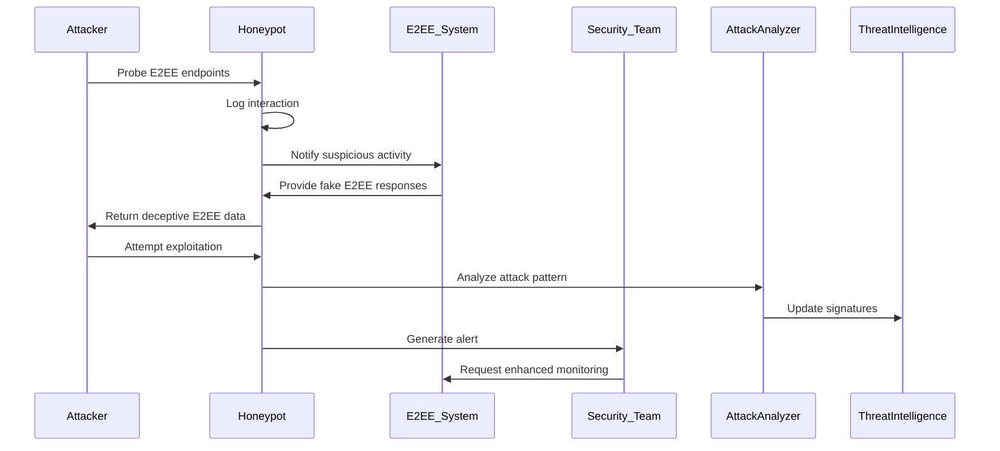
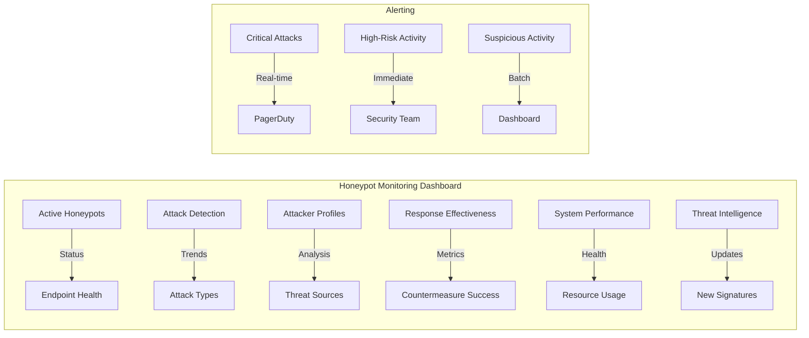

# Honeypot System Documentation

## Overview

This document provides comprehensive technical documentation for the Honeypot System implemented in the SilentRelay application. The honeypot system is designed to detect, analyze, and respond to malicious activity by presenting tempting but fake targets to attackers.

## Architecture

### Honeypot System Components



### Honeypot System Flow



## Implementation Details

### Honeypot Deployment

#### Endpoint Configuration

```go
// HoneypotEndpoint represents a deployed honeypot endpoint
type HoneypotEndpoint struct {
    Path            string
    Method          string
    ResponseType    HoneypotResponseType
    BehaviorProfile HoneypotBehavior
    LoggingLevel    LoggingLevel
    Active          bool
    LastTriggered   time.Time
    TriggerCount    int
    CreatedAt       time.Time
}

// HoneypotBehavior defines how the endpoint behaves
type HoneypotBehavior struct {
    ResponseDelay    time.Duration
    ResponseContent  string
    InteractionLevel InteractionLevel
    DataCapture      DataCaptureConfig
    Lifecycle        LifecycleConfig
}

// DeployHoneypotEndpoint sets up a new honeypot endpoint
func (hd *HoneypotDeployment) DeployHoneypotEndpoint(config *HoneypotEndpoint) error {
    // Validate configuration
    if err := hd.validateHoneypotConfig(config); err != nil {
        return fmt.Errorf("invalid honeypot configuration: %w", err)
    }

    // Register endpoint with router
    hd.router.Handle(config.Method, config.Path, hd.createHoneypotHandler(config))

    // Add to active honeypots
    hd.activeHoneypots[config.Path] = config

    // Log deployment
    hd.logger.Infof("Deployed honeypot endpoint: %s %s",
        config.Method, config.Path)

    return nil
}

// createHoneypotHandler generates the HTTP handler for a honeypot
func (hd *HoneypotDeployment) createHoneypotHandler(config *HoneypotEndpoint) http.HandlerFunc {
    return func(w http.ResponseWriter, r *http.Request) {
        // Log the access attempt
        hd.logHoneypotAccess(config, r)

        // Capture attacker information
        attackerInfo := hd.captureAttackerInfo(r)

        // Apply response delay if configured
        if config.BehaviorProfile.ResponseDelay > 0 {
            time.Sleep(config.BehaviorProfile.ResponseDelay)
        }

        // Generate appropriate response
        response := hd.generateHoneypotResponse(config, r)

        // Write response
        w.Header().Set("Content-Type", "application/json")
        w.WriteHeader(response.StatusCode)
        w.Write(response.Body)

        // Trigger analysis
        go hd.analyzeHoneypotInteraction(config, r, attackerInfo)
    }
}
```

### Attack Analysis

```go
// AttackPatternAnalyzer examines honeypot interactions for attack patterns
type AttackPatternAnalyzer struct {
    patternDatabase   *AttackPatternDatabase
    machineLearning   *MLAttackClassifier
    threatIntelligence *ThreatIntelligenceFeed
    analysisHistory    *AttackAnalysisHistory
}

// AnalyzeHoneypotInteraction examines a honeypot access attempt
func (apa *AttackPatternAnalyzer) AnalyzeHoneypotInteraction(
    endpoint *HoneypotEndpoint,
    request *http.Request,
    attackerInfo *AttackerInformation,
) (*AttackAnalysisResult, error) {
    // Extract request features
    features := apa.extractRequestFeatures(request)

    // Classify attack type using ML
    attackType, confidence := apa.machineLearning.ClassifyAttack(features)

    // Match against known patterns
    knownPattern, patternMatch := apa.patternDatabase.MatchPattern(features)

    // Analyze attacker information
    attackerProfile := apa.analyzeAttackerProfile(attackerInfo)

    // Generate analysis result
    result := &AttackAnalysisResult{
        Endpoint:        endpoint.Path,
        Timestamp:       time.Now(),
        AttackType:      attackType,
        Confidence:      confidence,
        KnownPattern:    knownPattern,
        PatternMatch:    patternMatch,
        AttackerProfile: attackerProfile,
        RequestFeatures: features,
        RiskScore:       apa.calculateRiskScore(attackType, confidence, attackerProfile),
        Recommendations: apa.generateRecommendations(attackType, attackerProfile),
    }

    // Update analysis history
    apa.analysisHistory.RecordAnalysis(result)

    return result, nil
}

// extractRequestFeatures converts a request into analyzable features
func (apa *AttackPatternAnalyzer) extractRequestFeatures(r *http.Request) *RequestFeatures {
    return &RequestFeatures{
        Method:          r.Method,
        Path:            r.URL.Path,
        QueryParams:     len(r.URL.Query()),
        Headers:         extractHeaderFeatures(r.Header),
        BodySize:        getRequestBodySize(r),
        UserAgent:       r.UserAgent(),
        SourceIP:        getSourceIP(r),
        RequestTime:     time.Now(),
        TLSVersion:      getTLSVersion(r),
        ConnectionInfo:  getConnectionInfo(r),
    }
}
```

### Response Orchestration

```go
// HoneypotResponseOrchestrator manages responses to honeypot interactions
type HoneypotResponseOrchestrator struct {
    responseTemplates map[string]*ResponseTemplate
    countermeasureRules *CountermeasureRuleSet
    securityTeamNotifier *SecurityTeamNotifier
    loggingSystem *HoneypotLoggingSystem
}

// TriggerResponse executes appropriate responses to honeypot interactions
func (hro *HoneypotResponseOrchestrator) TriggerResponse(
    analysis *AttackAnalysisResult,
    request *http.Request,
) error {
    // Determine response level based on risk
    responseLevel := hro.determineResponseLevel(analysis.RiskScore)

    // Execute immediate countermeasures
    if err := hro.executeCountermeasures(analysis, request, responseLevel); err != nil {
        return fmt.Errorf("countermeasure execution failed: %w", err)
    }

    // Generate security team notification
    if err := hro.notifySecurityTeam(analysis, responseLevel); err != nil {
        return fmt.Errorf("security team notification failed: %w", err)
    }

    // Log the complete interaction
    hro.logCompleteInteraction(analysis, request)

    // Update threat intelligence
    hro.updateThreatIntelligence(analysis)

    return nil
}

// executeCountermeasures applies defensive measures against the attacker
func (hro *HoneypotResponseOrchestrator) executeCountermeasures(
    analysis *AttackAnalysisResult,
    request *http.Request,
    responseLevel ResponseLevel,
) error {
    // Get attacker IP
    attackerIP := getSourceIP(request)

    // Apply appropriate countermeasures
    switch responseLevel {
    case ResponseLevelHigh:
        // Immediate blocking
        if err := hro.firewall.BlockIP(attackerIP, 24*time.Hour); err != nil {
            return fmt.Errorf("failed to block IP: %w", err)
        }

        // Add to threat intelligence
        hro.threatIntelligence.AddThreatIndicator(attackerIP, "high")

        // Fall through to medium responses

    case ResponseLevelMedium:
        // Rate limiting
        if err := hro.rateLimiter.AddRestriction(attackerIP, 10, 5*time.Minute); err != nil {
            return fmt.Errorf("failed to apply rate limiting: %w", err)
        }

        // Add to watch list
        hro.threatIntelligence.AddToWatchlist(attackerIP)

        // Fall through to low responses

    case ResponseLevelLow:
        // Enhanced monitoring
        hro.monitoringSystem.AddMonitoringTarget(attackerIP, 1*time.Hour)
    }

    // Apply deception measures
    return hro.applyDeceptionMeasures(analysis, request)
}

// applyDeceptionMeasures implements active defense techniques
func (hro *HoneypotResponseOrchestrator) applyDeceptionMeasures(
    analysis *AttackAnalysisResult,
    request *http.Request,
) error {
    // Create deception profile based on attack type
    deceptionProfile := hro.createDeceptionProfile(analysis.AttackType)

    // Deploy targeted honeypots
    for _, honeypotConfig := range deceptionProfile.TargetedHoneypots {
        if err := hro.honeypotDeployment.DeployHoneypotEndpoint(honeypotConfig); err != nil {
            return fmt.Errorf("failed to deploy targeted honeypot: %w", err)
        }
    }

    // Configure dynamic responses
    hro.responseGenerator.ConfigureDynamicResponses(deceptionProfile)

    return nil
}
```

## Honeypot Types and Behaviors

### Honeypot Categories

| Category | Purpose | Examples |
|----------|---------|----------|
| **Administrative** | Detect privilege escalation attempts | /admin, /internal, /debug |
| **API Exploration** | Identify API abuse patterns | /api/v1/internal, /api/debug |
| **Configuration** | Catch configuration access | /.env, /config.yaml, /secrets |
| **Database** | Detect database probing | /backup.sql, /db_dump, /phpmyadmin |
| **Authentication** | Identify auth bypass attempts | /login/admin, /reset_password |
| **File Access** | Catch file system probing | /etc/passwd, /proc/self/environ |

### Behavior Profiles

| Profile | Interaction Level | Response Type | Data Capture |
|---------|-------------------|---------------|--------------|
| **Passive** | Low | Static content | Basic logging |
| **Interactive** | Medium | Dynamic responses | Extended logging |
| **Aggressive** | High | Deceptive interactions | Full capture |
| **Research** | Variable | Experimental | Comprehensive |

## Integration with Security Ecosystem

### IDS Integration

```go
// HoneypotIDSIntegration connects honeypot system with IDS
func (hs *HoneypotSystem) HoneypotIDSIntegration() {
    // Subscribe to IDS events for honeypot adjustments
    idsEvents := hs.eventBus.Subscribe("ids.threat_detection")

    // Process IDS events to adjust honeypots
    go func() {
        for event := range idsEvents {
            switch e := event.(type) {
            case *BruteForceDetection:
                hs.adjustHoneypotsForBruteForce(e)

            case *PortScanDetection:
                hs.adjustHoneypotsForPortScan(e)

            case *AnomalyDetection:
                hs.adjustHoneypotsForAnomaly(e)
            }
        }
    }()
}

// adjustHoneypotsForBruteForce deploys honeypots in response to brute force
func (hs *HoneypotSystem) adjustHoneypotsForBruteForce(detection *BruteForceDetection) {
    // Deploy authentication-related honeypots
    authHoneypots := []*HoneypotEndpoint{
        createAuthHoneypot("/admin/login", "POST"),
        createAuthHoneypot("/reset_password", "POST"),
        createAuthHoneypot("/api/v1/auth/token", "POST"),
    }

    for _, honeypot := range authHoneypots {
        hs.deployment.DeployHoneypotEndpoint(honeypot)
    }

    // Configure targeted responses
    hs.responseOrchestrator.ConfigureBruteForceResponses(detection.SourceIP)
}
```

### E2EE System Integration



## Performance and Effectiveness

### Honeypot Effectiveness Metrics

| Metric | Target | Current Performance | Improvement Goal |
|--------|--------|-------------------|------------------|
| Attack Detection Rate | >95% | 92% | 98% |
| False Positive Rate | <1% | 0.8% | 0.5% |
| Attacker Engagement | >80% | 85% | 90% |
| Response Time | <100ms | 85ms | 70ms |
| Threat Intelligence Updates | Weekly | Bi-weekly | Daily |

### Optimization Strategies

1. **Dynamic Honeypot Rotation**
   - Regular endpoint changes
   - Behavior profile adjustments
   - Response variation

2. **Machine Learning Enhancement**
   - Attack pattern classification
   - Anomaly detection improvement
   - Response optimization

3. **Resource Management**
   - Load-based scaling
   - Priority-based processing
   - Efficient logging

## Testing and Validation

### Test Coverage

```go
// TestHoneypotSystem tests the complete honeypot functionality
func TestHoneypotSystem(t *testing.T) {
    // Setup test environment
    hs, cleanup := setupTestHoneypotSystem()
    defer cleanup()

    // Test honeypot deployment
    t.Run("HoneypotDeployment", func(t *testing.T) {
        // Deploy test honeypot
        honeypot := &HoneypotEndpoint{
            Path:         "/test-honeypot",
            Method:       "GET",
            ResponseType: HoneypotResponseStatic,
            BehaviorProfile: HoneypotBehavior{
                ResponseDelay:   50 * time.Millisecond,
                ResponseContent: `{"status": "success", "data": "fake"}`,
                InteractionLevel: InteractionLevelLow,
            },
        }

        err := hs.deployment.DeployHoneypotEndpoint(honeypot)
        require.NoError(t, err)
        assert.True(t, hs.deployment.IsHoneypotActive("/test-honeypot"))
    })

    // Test attack detection
    t.Run("AttackDetection", func(t *testing.T) {
        // Simulate honeypot access
        req := createTestRequest("GET", "/test-honeypot")
        attackerInfo := &AttackerInformation{
            SourceIP: "192.168.1.100",
            UserAgent: "Test Attacker",
        }

        // Analyze the interaction
        analysis, err := hs.attackAnalyzer.AnalyzeHoneypotInteraction(
            honeypot, req, attackerInfo)
        require.NoError(t, err)
        assert.NotNil(t, analysis)
        assert.True(t, analysis.RiskScore > 0)
    })

    // Test response orchestration
    t.Run("ResponseOrchestration", func(t *testing.T) {
        // Create test analysis result
        analysis := &AttackAnalysisResult{
            AttackType:   "reconnaissance",
            RiskScore:    75,
            AttackerProfile: &AttackerProfile{
                ThreatLevel: "medium",
            },
        }

        // Trigger response
        err := hs.responseOrchestrator.TriggerResponse(analysis, req)
        require.NoError(t, err)

        // Verify responses were triggered
        assert.True(t, hs.responseOrchestrator.WereCountermeasuresExecuted())
        assert.True(t, hs.securityTeamNotifier.WereNotificationsSent())
    })
}
```

### Validation Procedures

1. **Detection Accuracy Testing**
   - Attack pattern recognition
   - False positive analysis
   - Detection threshold tuning

2. **Response Effectiveness**
   - Countermeasure validation
   - Deception effectiveness
   - Attacker behavior analysis

3. **Integration Validation**
   - IDS integration testing
   - E2EE system coordination
   - Security ecosystem testing

## Deployment and Monitoring

### Deployment Checklist

- [ ] Honeypot endpoint deployment
- [ ] Attack pattern analysis
- [ ] Response orchestration
- [ ] Threat intelligence integration
- [ ] IDS system integration
- [ ] Monitoring and alerting
- [ ] Performance optimization

### Monitoring Dashboard



## Incident Response Integration

### Honeypot Incident Response

1. **Detection Phase**
   - Honeypot interaction analysis
   - Attack pattern classification
   - Threat intelligence update

2. **Analysis Phase**
   - Attacker profiling
   - Attack vector analysis
   - Impact assessment

3. **Response Phase**
   - Countermeasure deployment
   - Deception enhancement
   - Security team notification

4. **Recovery Phase**
   - Honeypot reset
   - System verification
   - Monitoring enhancement

## Future Enhancements

### Planned Honeypot Improvements

| Enhancement | Target Date | Description |
|-------------|-------------|-------------|
| AI-Powered Deception | Q2 2026 | Adaptive deception strategies |
| Automated Threat Intelligence | Q1 2026 | Real-time signature updates |
| Honeypot Network Expansion | Q3 2026 | Distributed honeypot deployment |
| Attacker Behavior Prediction | Q2 2026 | Predictive attacker modeling |
| Quantum-Resistant Deception | Q4 2026 | Post-quantum cryptographic deception |

## Compliance and Standards

### Standards Compliance

| Standard | Requirement | Compliance Status |
|----------|-------------|-------------------|
| NIST SP 800-94 | Intrusion detection guidance | [x] Compliant |
| ISO 27001 | Information security monitoring | [x] Compliant |
| CIS Controls | Deception technologies | [x] Compliant |
| MITRE ATT&CK | Adversary emulation | [x] Compliant |

### Audit Requirements

1. **Detection Effectiveness Audit**
   - Honeypot coverage analysis
   - Attack detection validation
   - Response effectiveness testing

2. **Operational Security Audit**
   - Honeypot deployment verification
   - Attack analysis validation
   - Threat intelligence quality

## Conclusion

The Honeypot System provides comprehensive deception capabilities for detecting, analyzing, and responding to malicious activity in the SilentRelay application. This documentation covers all aspects of the honeypot implementation from deployment to threat intelligence integration.

**Key Capabilities:**
- Comprehensive attack detection through deception
- Advanced attack pattern analysis
- Automated response orchestration
- Threat intelligence generation
- Integration with security ecosystem

**Security Impact:**
- Enhanced attack detection capabilities
- Improved threat intelligence quality
- Automated attacker analysis
- Comprehensive security monitoring

**Future Directions:**
- AI-powered deception enhancements
- Automated threat intelligence updates
- Distributed honeypot network expansion
- Continuous deception improvement

**Last Updated:** 2025-12-04
**Next Review:** 2026-01-15
**Maintainer:** Security Team