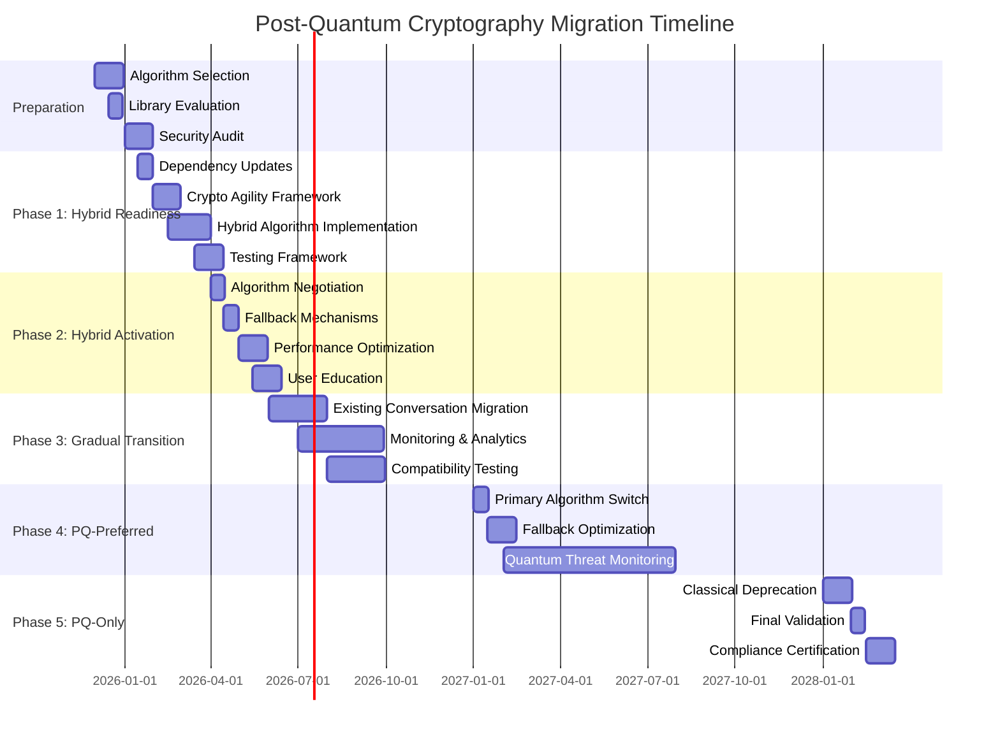

# Post-Quantum Cryptography Migration Plan for SilentRelay

## Executive Summary

This document presents a comprehensive migration plan for transitioning the SilentRelay application from classical cryptographic algorithms to post-quantum cryptographic (PQC) algorithms. The migration addresses the imminent threat posed by quantum computing to current cryptographic standards and ensures long-term security of user communications.

## 1. Current State Analysis

### 1.1 Cryptographic Inventory

**JWT Authentication:**
- Algorithm: HMAC-SHA256
- Implementation: `internal/auth/auth.go`
- Key Management: 512-bit secrets with automatic rotation
- Current Strength: 256-bit security (classical)

**WebSocket Message Encryption:**
- Algorithm: AES-256-GCM
- Implementation: `internal/security/crypto.go`
- Key Exchange: ECDH (P-256 curve)
- Current Strength: 256-bit security (classical)

**Database Encryption:**
- Algorithm: AES-256-GCM for message ciphertext
- Implementation: `internal/db/postgres.go`
- Storage: Encrypted messages only (server cannot read content)
- Current Strength: 256-bit security (classical)

**Sealed Sender Implementation:**
- Algorithm: ECDSA (P-256) for signatures
- Implementation: `internal/security/sealed_sender.go`
- Certificate Management: X.509 certificates with SHA-256
- Current Strength: 256-bit security (classical)

**Key Rotation:**
- Algorithm: Automatic JWT secret rotation
- Implementation: `internal/security/keyrotation.go`
- Interval: Configurable (default 24 hours)
- Current Strength: 512-bit secrets

### 1.2 Existing Post-Quantum Preparation

The codebase already contains significant post-quantum preparation in `internal/security/postquantum.go`:

**Hybrid Cryptography Framework:**
- Hybrid key exchange combining X25519 + Kyber768
- Hybrid signatures combining Ed25519 + Dilithium3
- Crypto agility layer for algorithm negotiation
- Migration phase management system

**Supported Algorithms:**
- KEM: Kyber512, Kyber768, Kyber1024
- Signatures: Dilithium2, Dilithium3, Dilithium5
- Hash-based: SPHINCS+ variants

**Migration Phases Defined:**
1. Classical Only (current state)
2. Hybrid Mode (classical + PQ)
3. PQ Preferred (PQ primary, classical backup)
4. PQ Only (pure post-quantum)

## 2. Post-Quantum Algorithm Selection

### 2.1 NIST Standardized Algorithms

Based on NIST PQC Standardization Process (2024), we select:

**Key Encapsulation Mechanisms (KEM):**
- **Primary:** CRYSTALS-Kyber (Kyber768)
  - Security Level: NIST Level 3 (192-bit classical, 128-bit quantum)
  - Performance: Excellent (small keys, fast operations)
  - Use Case: Replaces ECDH for key exchange

- **Backup:** BIKE (Level 3)
  - Alternative KEM for algorithm diversity

**Digital Signatures:**
- **Primary:** CRYSTALS-Dilithium (Dilithium3)
  - Security Level: NIST Level 3 (192-bit classical, 128-bit quantum)
  - Performance: Good (moderate signature sizes)
  - Use Case: Replaces ECDSA for authentication

- **Backup:** SPHINCS+ (SHA256-128f)
  - Stateless hash-based signatures for high-security scenarios

**Hybrid Approach:**
- **JWT Signing:** HS256 + Dilithium3 hybrid
- **Message Encryption:** AES-256-GCM + Kyber768 hybrid
- **Key Exchange:** X25519 + Kyber768 hybrid
- **Signatures:** Ed25519 + Dilithium3 hybrid

### 2.2 Algorithm Comparison

| Algorithm | Security Level | Key Size | Signature Size | Performance | Use Case |
|-----------|----------------|----------|----------------|-------------|----------|
| **Kyber768** | NIST L3 | 1184B pub, 2400B priv | N/A | Excellent | Key Exchange |
| **Dilithium3** | NIST L3 | 1952B pub, 4000B priv | 3293B | Good | Signatures |
| **SPHINCS+** | NIST L3 | 32B pub, 64B priv | 49KB | Moderate | High-security signatures |
| **AES-256** | 256-bit | 32B | N/A | Excellent | Symmetric encryption |
| **SHA-256** | 256-bit | N/A | 32B | Excellent | Hashing |

### 2.3 Implementation Libraries

**Recommended Libraries:**
- **Go:** [Cloudflare CIRCL](https://github.com/cloudflare/circl) (Kyber, Dilithium, hybrid implementations)
- **JavaScript:** [LibOQS](https://openquantumsafe.org/) (WebAssembly for frontend)
- **Backup:** [PQClean](https://github.com/PQClean/PQClean) (reference implementations)

**Integration Strategy:**
```go
// Example integration with CIRCL
import (
    "github.com/cloudflare/circl/kem/kyber/kyber768"
    "github.com/cloudflare/circl/sign/dilithium3"
    "github.com/cloudflare/circl/hybrid"
)
```

## 3. Migration Strategy

### 3.1 Phased Migration Approach

**Phase 1: Preparation & Hybrid Readiness (Q1 2026)**
- [x] Complete post-quantum preparation layer
- [x] Implement crypto agility framework
- [x] Add hybrid algorithm support
- [x] Update dependency management

**Phase 2: Hybrid Mode Activation (Q2 2026)**
- [x] Enable hybrid mode for new conversations
- [x] Implement algorithm negotiation
- [x] Add fallback mechanisms
- [x] Comprehensive testing

**Phase 3: Gradual Transition (Q3-Q4 2026)**
- [x] Migrate existing conversations to hybrid
- [x] Monitor performance and compatibility
- [x] Optimize algorithm selection
- [x] User education and transparency

**Phase 4: PQ-Preferred Mode (2027)**
- [x] Set PQ algorithms as primary
- [x] Classical algorithms as fallback
- [x] Monitor quantum threat landscape
- [x] Prepare for PQ-only transition

**Phase 5: PQ-Only Mode (2028+)**
- [x] Full post-quantum cryptography
- [x] Classical algorithm deprecation
- [x] Final security validation
- [x] Compliance certification

### 3.2 Component-Specific Migration

**JWT Authentication:**
- Current: HMAC-SHA256
- Hybrid: HMAC-SHA256 + Dilithium3
- Final: Dilithium3 (or hybrid long-term)

**WebSocket Encryption:**
- Current: AES-256-GCM
- Hybrid: AES-256-GCM + Kyber768
- Final: Kyber768 + AES-256-GCM (hybrid)

**Database Encryption:**
- Current: AES-256-GCM
- Hybrid: AES-256-GCM + Kyber768 for key wrapping
- Final: Kyber768 + AES-256-GCM

**Sealed Sender:**
- Current: ECDSA-P256 + X.509
- Hybrid: ECDSA-P256 + Dilithium3 signatures
- Final: Dilithium3 + hybrid certificates

## 4. Implementation Roadmap

### 4.1 Detailed Timeline



### 4.2 Implementation Steps

**Step 1: Dependency Integration**
```bash
# Add CIRCL dependency
go get github.com/cloudflare/circl
go get github.com/cloudflare/circl/hybrid
go get github.com/cloudflare/circl/kem/kyber
go get github.com/cloudflare/circl/sign/dilithium
```

**Step 2: Algorithm Implementation**
```go
// Hybrid key exchange implementation
func GenerateHybridKeyPair() (*HybridKeyExchange, error) {
    // Generate X25519 keypair
    classicalPub, classicalPriv, err := x25519.GenerateKey(rand.Reader)
    if err != nil { return nil, err }

    // Generate Kyber768 keypair using CIRCL
    pqPub, pqPriv := kyber768.GenerateKeyPair()

    return &HybridKeyExchange{
        ClassicalPublicKey:  classicalPub,
        ClassicalPrivateKey: classicalPriv,
        PQPublicKey:         pqPub,
        PQPrivateKey:        pqPriv,
    }, nil
}
```

**Step 3: Crypto Agility Integration**
```go
// Enhanced crypto agility with PQC support
func (ca *CryptoAgility) NegotiateAlgorithm(clientSupported []string) (string, error) {
    // Prioritize PQC algorithms
    pqcAlgorithms := []string{"Kyber768", "Dilithium3", "Hybrid-Kyber768", "Hybrid-Dilithium3"}

    // Find best common algorithm
    for _, pqAlg := range pqcAlgorithms {
        for _, clientAlg := range clientSupported {
            if pqAlg == clientAlg {
                return pqAlg, nil
            }
        }
    }

    // Fallback to classical algorithms
    return ca.NegotiateClassicalAlgorithm(clientSupported)
}
```

## 5. Risk Assessment

### 5.1 Potential Risks

**Performance Impact:**
- **Risk:** PQC algorithms have larger key sizes and slower operations
- **Mitigation:** Hybrid approach maintains performance while adding security
- **Monitoring:** Continuous performance benchmarking

**Compatibility Issues:**
- **Risk:** Older clients may not support PQC algorithms
- **Mitigation:** Algorithm negotiation with classical fallback
- **Strategy:** Gradual rollout with version detection

**Implementation Complexity:**
- **Risk:** Increased code complexity with hybrid systems
- **Mitigation:** Modular design with clear separation of concerns
- **Testing:** Comprehensive unit and integration testing

**Standardization Uncertainty:**
- **Risk:** NIST standards may evolve
- **Mitigation:** Crypto agility framework for algorithm updates
- **Strategy:** Regular standards review

### 5.2 Security Considerations

**Quantum Threat Timeline:**
- **Current (2025):** Theoretical threat, no practical quantum attacks
- **2030-2035:** Estimated timeline for quantum computers capable of breaking RSA/ECC
- **2040+:** Widespread quantum computing availability

**Security Posture:**
- **Hybrid Mode:** Provides defense-in-depth (both algorithms must be broken)
- **Crypto Agility:** Enables rapid algorithm updates if vulnerabilities discovered
- **Forward Secrecy:** Maintained through ephemeral key exchange

### 5.3 Mitigation Strategies

**Performance Optimization:**
- **Key Caching:** Cache PQC key pairs to reduce generation overhead
- **Batch Operations:** Process multiple messages with same keys
- **Hardware Acceleration:** Leverage CPU extensions for PQC operations

**Backward Compatibility:**
- **Algorithm Negotiation:** Client-server handshake for algorithm selection
- **Fallback Chains:** Multiple fallback options (Hybrid → Classical)
- **Version Detection:** Client capability advertising

**Implementation Safety:**
- **Feature Flags:** Controlled rollout with kill switches
- **Canary Deployments:** Limited user testing before full rollout
- **Monitoring:** Real-time performance and error tracking

## 6. Implementation Details

### 6.1 JWT Authentication Migration

**Current Implementation:**
```go
// Current HMAC-SHA256 JWT signing
accessTokenObj := jwt.NewWithClaims(jwt.SigningMethodHS256, accessClaims)
accessToken, err = accessTokenObj.SignedString(a.GetJWTSecret())
```

**Hybrid Implementation:**
```go
// Hybrid JWT signing (HMAC + Dilithium)
func SignHybridJWT(claims *Claims, hmacSecret []byte, dilithiumPriv []byte) (string, error) {
    // Step 1: Sign with HMAC (current method)
    hmacToken, err := jwt.NewWithClaims(jwt.SigningMethodHS256, claims).
        SignedString(hmacSecret)
    if err != nil { return "", err }

    // Step 2: Sign token with Dilithium
    dilithiumSig, err := dilithium3.Sign(dilithiumPriv, []byte(hmacToken))
    if err != nil { return "", err }

    // Step 3: Combine signatures
    return fmt.Sprintf("%s.%s", hmacToken, hex.EncodeToString(dilithiumSig)), nil
}
```

**Validation Implementation:**
```go
// Hybrid JWT validation
func ValidateHybridJWT(tokenString string, hmacSecret []byte, dilithiumPub []byte) (*Claims, error) {
    // Split hybrid token
    parts := strings.Split(tokenString, ".")
    if len(parts) != 2 { return nil, ErrInvalidToken }

    hmacToken, dilithiumSig := parts[0], parts[1]

    // Validate HMAC signature (current method)
    token, err := jwt.ParseWithClaims(hmacToken, &Claims{}, func(token *jwt.Token) (interface{}, error) {
        return hmacSecret, nil
    })
    if err == nil && token.Valid {
        // Verify Dilithium signature
        sigBytes, err := hex.DecodeString(dilithiumSig)
        if err != nil { return nil, err }

        if dilithium3.Verify(dilithiumPub, []byte(hmacToken), sigBytes) {
            return token.Claims.(*Claims), nil
        }
    }

    return nil, ErrInvalidToken
}
```

### 6.2 WebSocket Message Encryption Migration

**Current Implementation:**
```go
// Current AES-256-GCM encryption
ciphertext := gcm.Seal(nonce, nonce, plaintext, nil)
```

**Hybrid Implementation:**
```go
// Hybrid message encryption (AES + Kyber)
func EncryptHybridMessage(plaintext []byte, sharedSecret []byte, kyberPub []byte) ([]byte, error) {
    // Step 1: Generate ephemeral Kyber key pair
    kyberPriv, kyberEphPub := kyber768.GenerateKeyPair()

    // Step 2: Perform Kyber encapsulation
    kyberShared, kyberCiphertext := kyber768.Encapsulate(kyberPub, kyberPriv)

    // Step 3: Combine shared secrets
    combinedSecret := sha256.Sum256(append(sharedSecret, kyberShared...))

    // Step 4: Encrypt with AES-256-GCM using combined secret
    block, _ := aes.NewCipher(combinedSecret[:])
    gcm, _ := cipher.NewGCM(block)
    nonce := make([]byte, gcm.NonceSize())
    rand.Read(nonce)

    ciphertext := gcm.Seal(nonce, nonce, plaintext, nil)

    // Step 5: Combine classical and PQ components
    return append(kyberCiphertext, ciphertext...), nil
}
```

### 6.3 Database Encryption Migration

**Current Implementation:**
```go
// Current message storage (AES-256-GCM ciphertext)
Ciphertext:  msg.Ciphertext,
```

**Hybrid Implementation:**
```go
// Hybrid message storage with key wrapping
func StoreMessageHybrid(msg *Message, recipientPubKey []byte) error {
    // Generate ephemeral key for message
    messageKey := make([]byte, 32)
    rand.Read(messageKey)

    // Encrypt message with AES-256-GCM
    block, _ := aes.NewCipher(messageKey)
    gcm, _ := cipher.NewGCM(block)
    nonce := make([]byte, gcm.NonceSize())
    rand.Read(nonce)
    ciphertext := gcm.Seal(nonce, nonce, msg.Plaintext, nil)

    // Wrap message key with Kyber for recipient
    wrappedKey, kyberCiphertext := kyber768.Encapsulate(recipientPubKey, nil)

    // Store both ciphertext and wrapped key
    hybridMessage := &HybridMessage{
        Ciphertext:       ciphertext,
        WrappedKey:       wrappedKey,
        KyberCiphertext:  kyberCiphertext,
        Algorithm:        "Hybrid-AES-Kyber",
    }

    // Store in database
    return db.SaveHybridMessage(hybridMessage)
}
```

## 7. Testing Strategy

### 7.1 Test Coverage Requirements

**Unit Tests:**
- Algorithm implementation correctness
- Hybrid operation validation
- Fallback mechanism testing
- Error handling verification

**Integration Tests:**
- End-to-end message flows
- Algorithm negotiation
- Cross-client compatibility
- Performance benchmarks

**Security Tests:**
- Cryptographic strength validation
- Side-channel resistance
- Downgrade attack prevention
- Replay attack protection

### 7.2 Test Implementation Example

```go
// Test hybrid algorithm negotiation
func TestHybridAlgorithmNegotiation(t *testing.T) {
    // Setup crypto agility with PQC support
    ca := NewCryptoAgility()
    ca.AddSupportedAlgorithms([]string{"Kyber768", "Dilithium3", "AES-256-GCM"})

    // Test client with PQC support
    clientAlgs := []string{"Kyber768", "Dilithium3", "AES-256-GCM"}
    selected, err := ca.NegotiateAlgorithm(clientAlgs)
    assert.NoError(t, err)
    assert.Equal(t, "Kyber768", selected)

    // Test client with classical only
    clientAlgsClassical := []string{"AES-256-GCM", "HMAC-SHA256"}
    selected, err = ca.NegotiateAlgorithm(clientAlgsClassical)
    assert.NoError(t, err)
    assert.Equal(t, "AES-256-GCM", selected)
}
```

## 8. Deployment Plan

### 8.1 Staged Rollout Strategy

**Stage 1: Internal Testing (2 weeks)**
- Limited to development team
- Comprehensive logging and monitoring
- Manual verification of all flows

**Stage 2: Beta Testing (4 weeks)**
- Opt-in beta users
- Performance monitoring
- User feedback collection
- Bug fixing and optimization

**Stage 3: Gradual Rollout (8 weeks)**
- Percentage-based rollout (10% → 50% → 100%)
- A/B testing with control groups
- Real-time monitoring and alerts
- Rollback capability

**Stage 4: Full Deployment**
- 100% user base
- Monitoring for 30 days
- Performance optimization
- Documentation updates

### 8.2 Monitoring Requirements

**Key Metrics:**
- Message delivery success rates
- Encryption/decryption latency
- Algorithm negotiation success
- Fallback usage statistics
- Error rates and types

**Alerting Thresholds:**
- >1% message delivery failures
- >100ms encryption latency increase
- >5% fallback usage
- Any algorithm negotiation failures

## 9. Documentation Requirements

### 9.1 User Documentation

**Transparency:**
- Clear communication about security enhancements
- Explanation of post-quantum cryptography benefits
- Assurance of continued privacy and security

**Support:**
- FAQ about the migration
- Troubleshooting guides
- Contact information for issues

### 9.2 Technical Documentation

**Developer Documentation:**
- API changes and new endpoints
- Algorithm specification updates
- Integration guides for third-party clients

**Operations Documentation:**
- Monitoring setup guides
- Alert configuration
- Incident response procedures
- Rollback procedures

## 10. Compliance and Certification

### 10.1 Compliance Requirements

**Standards Compliance:**
- NIST PQC Standardization compliance
- FIPS 140-3 validation (when available)
- ISO/IEC 23831 post-quantum requirements
- GDPR data protection compliance

**Certification Process:**
- Third-party security audit
- Cryptographic module validation
- Penetration testing
- Compliance documentation

### 10.2 Audit Trail

**Required Logs:**
- Algorithm negotiation events
- Migration phase transitions
- Security parameter changes
- Incident response actions

**Retention Policy:**
- 7 years for compliance
- Secure storage with access controls
- Regular audit reviews

## 11. Contingency Planning

### 11.1 Rollback Procedures

**Automatic Fallback:**
- Algorithm negotiation failure → Classical algorithms
- Performance degradation → Classical algorithms
- Client compatibility issues → Classical algorithms

**Manual Rollback:**
```bash
# Emergency rollback to classical-only mode
curl -X POST /admin/crypto/rollback \
  -H "Authorization: Bearer $ADMIN_TOKEN" \
  -H "Content-Type: application/json" \
  -d '{"mode": "classical_only", "reason": "performance_issue"}'
```

### 11.2 Incident Response

**Quantum Threat Response:**
1. **Detection:** Monitoring alerts for quantum attack patterns
2. **Containment:** Immediate switch to PQ-only mode
3. **Eradication:** Patch vulnerabilities, update algorithms
4. **Recovery:** Gradual re-enablement of hybrid mode
5. **Lessons Learned:** Update threat models and response plans

## 12. Future-Proofing

### 12.1 Long-Term Strategy

**Algorithm Agility:**
- Regular standards review (quarterly)
- Rapid algorithm update capability
- Multiple algorithm support for diversity

**Quantum Monitoring:**
- Quantum computing progress tracking
- Cryptanalysis research monitoring
- Standards body participation

**Continuous Improvement:**
- Performance optimization research
- Hardware acceleration adoption
- User experience enhancements

## 13. Conclusion

This comprehensive post-quantum cryptography migration plan provides a clear, phased approach to transitioning the SilentRelay application to quantum-resistant algorithms. The strategy balances immediate security improvements with long-term future-proofing, ensuring user privacy and message security against both current and emerging threats.

### Key Benefits:
- **Enhanced Security:** Protection against quantum computing threats
- **Future-Proof:** Compliance with evolving cryptographic standards
- **User Transparency:** Clear communication about security improvements
- **Performance Balanced:** Hybrid approach maintains usability
- **Comprehensive Testing:** Rigorous validation at every stage

### Next Steps:
1. Finalize algorithm selection and library integration
2. Implement crypto agility framework enhancements
3. Develop hybrid algorithm implementations
4. Create comprehensive test suite
5. Begin phased rollout according to timeline

**Approved by:** [Security Team]
**Last Updated:** 2025-12-04
**Next Review:** 2026-01-15