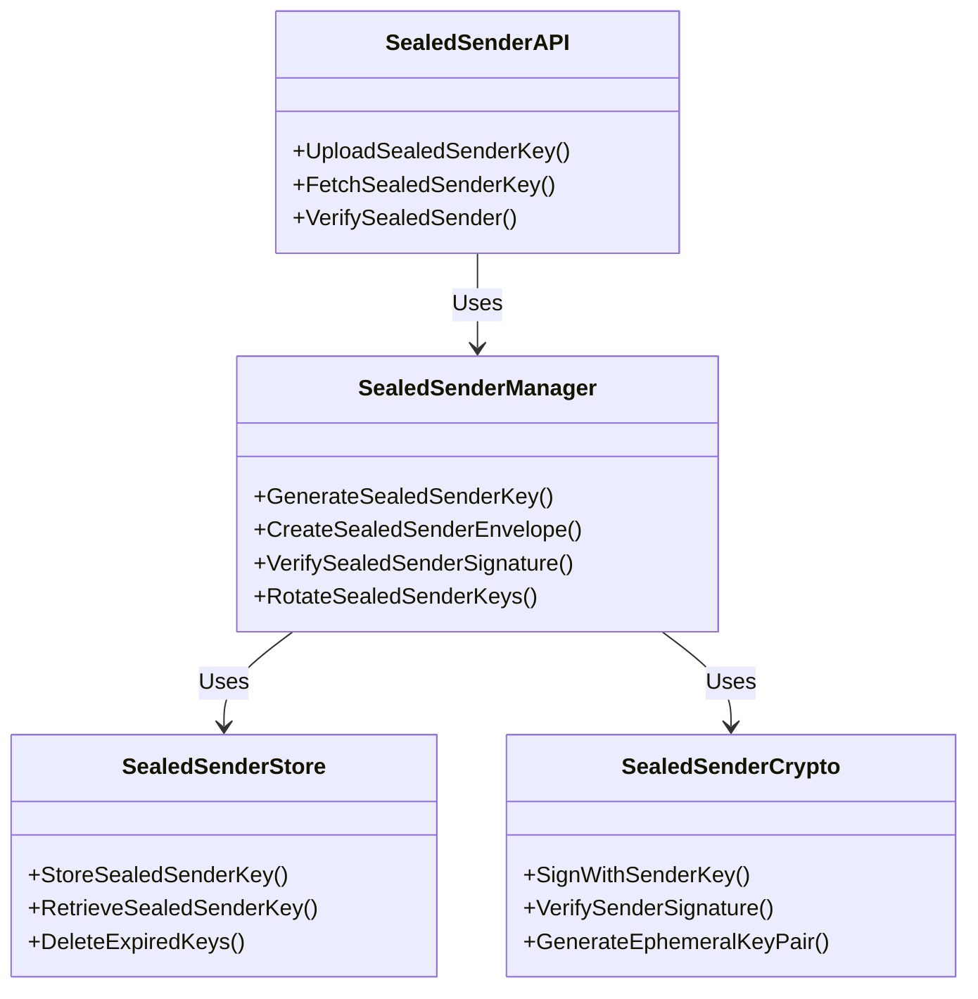
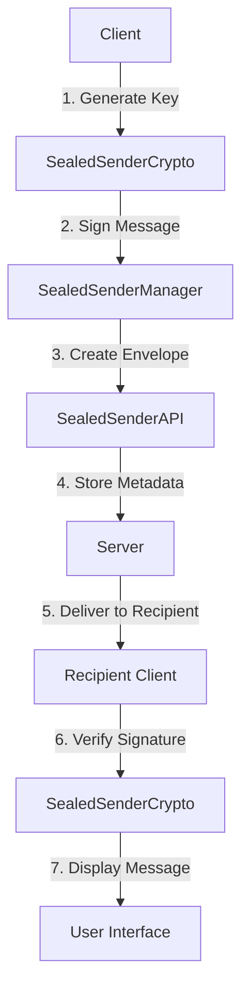
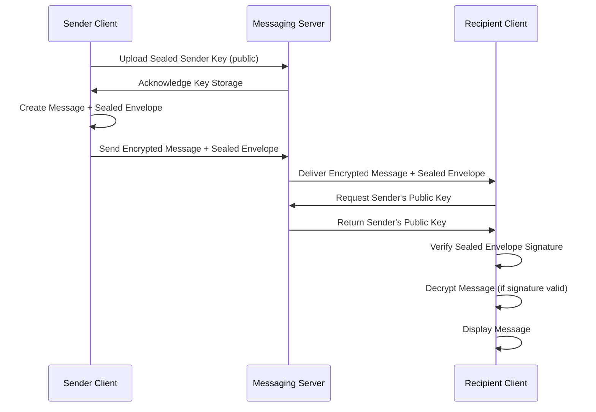

# Sealed Sender Implementation

## Overview

This document provides comprehensive technical documentation for the Sealed Sender implementation in the SilentRelay application. Sealed Sender is a privacy-enhancing feature that hides sender metadata from the server, preventing metadata analysis and enhancing user privacy.

## Architecture

### Core Components



### System Architecture



## Implementation Details

### Key Management

#### Key Generation

```go
// GenerateSealedSenderKeyPair creates a new ECDSA key pair for sealed sender
func GenerateSealedSenderKeyPair() (*SealedSenderKeyPair, error) {
    // Generate P-256 elliptic curve key pair
    privateKey, err := ecdsa.GenerateKey(elliptic.P256(), rand.Reader)
    if err != nil {
        return nil, fmt.Errorf("failed to generate sealed sender key: %w", err)
    }

    // Extract public key
    publicKey := &privateKey.PublicKey

    // Create key pair structure
    keyPair := &SealedSenderKeyPair{
        PrivateKey: privateKey,
        PublicKey: publicKey,
        GeneratedAt: time.Now(),
        ExpiresAt: time.Now().Add(30 * 24 * time.Hour), // 30-day validity
        KeyID: uuid.New().String(),
    }

    return keyPair, nil
}
```

#### Key Storage

```go
// SealedSenderKeyStore provides secure storage for sealed sender keys
type SealedSenderKeyStore struct {
    db             *sql.DB
    encryptionKey   []byte
    keyCache        *lru.Cache
    cacheMutex      sync.RWMutex
}

// StoreSealedSenderKey securely stores a sealed sender key
func (s *SealedSenderKeyStore) StoreSealedSenderKey(userID string, keyPair *SealedSenderKeyPair) error {
    // Serialize the private key
    privateKeyBytes, err := x509.MarshalECPrivateKey(keyPair.PrivateKey)
    if err != nil {
        return fmt.Errorf("failed to serialize private key: %w", err)
    }

    // Encrypt the private key
    encryptedKey, err := encryptKey(privateKeyBytes, s.encryptionKey)
    if err != nil {
        return fmt.Errorf("failed to encrypt private key: %w", err)
    }

    // Store in database
    _, err = s.db.Exec(`
        INSERT INTO sealed_sender_keys
        (user_id, key_id, public_key, encrypted_private_key, generated_at, expires_at)
        VALUES ($1, $2, $3, $4, $5, $6)
        ON CONFLICT (user_id) DO UPDATE SET
        public_key = EXCLUDED.public_key,
        encrypted_private_key = EXCLUDED.encrypted_private_key,
        generated_at = EXCLUDED.generated_at,
        expires_at = EXCLUDED.expires_at
    `, userID, keyPair.KeyID, encodePublicKey(keyPair.PublicKey),
       encryptedKey, keyPair.GeneratedAt, keyPair.ExpiresAt)

    if err != nil {
        return fmt.Errorf("failed to store sealed sender key: %w", err)
    }

    // Update cache
    s.cacheMutex.Lock()
    defer s.cacheMutex.Unlock()
    s.keyCache.Add(userID, keyPair)

    return nil
}
```

### Message Sealing Process

#### Creating Sealed Sender Envelopes

```go
// CreateSealedSenderEnvelope creates a sealed sender envelope for a message
func (m *SealedSenderManager) CreateSealedSenderEnvelope(
    senderID string,
    recipientID string,
    messageID string,
    timestamp time.Time,
) (*SealedSenderEnvelope, error) {
    // Retrieve sender's sealed sender key
    keyPair, err := m.keyStore.RetrieveSealedSenderKey(senderID)
    if err != nil {
        return nil, fmt.Errorf("failed to retrieve sender key: %w", err)
    }

    // Create the envelope data to sign
    envelopeData := fmt.Sprintf("%s:%s:%s:%d",
        senderID, recipientID, messageID, timestamp.Unix())

    // Sign the envelope data
    signature, err := m.crypto.SignWithSenderKey(keyPair.PrivateKey, []byte(envelopeData))
    if err != nil {
        return nil, fmt.Errorf("failed to sign envelope: %w", err)
    }

    // Create the sealed sender envelope
    envelope := &SealedSenderEnvelope{
        SenderKeyID:    keyPair.KeyID,
        RecipientID:     recipientID,
        MessageID:       messageID,
        Timestamp:       timestamp,
        Signature:      signature,
        SignatureAlgorithm: "ECDSA-P256-SHA256",
    }

    return envelope, nil
}
```

### Signature Verification

```go
// VerifySealedSenderSignature verifies the authenticity of a sealed sender envelope
func (m *SealedSenderManager) VerifySealedSenderSignature(
    envelope *SealedSenderEnvelope,
    senderPublicKey *ecdsa.PublicKey,
) (bool, error) {
    // Reconstruct the data that was signed
    signedData := fmt.Sprintf("%s:%s:%s:%d",
        envelope.SenderKeyID, envelope.RecipientID,
        envelope.MessageID, envelope.Timestamp.Unix())

    // Verify the signature
    valid, err := m.crypto.VerifySenderSignature(
        senderPublicKey, []byte(signedData), envelope.Signature)
    if err != nil {
        return false, fmt.Errorf("signature verification failed: %w", err)
    }

    if !valid {
        return false, nil
    }

    // Additional validation
    if time.Since(envelope.Timestamp) > 24*time.Hour {
        return false, fmt.Errorf("envelope timestamp too old")
    }

    return true, nil
}
```

## Security Features

### Privacy Enhancements

1. **Metadata Protection**
   - Server cannot see sender-recipient relationships
   - Prevents social graph analysis
   - Enhances user privacy

2. **Forward Secrecy**
   - Ephemeral key rotation
   - Limited key validity periods
   - Automatic key expiration

3. **Tamper Resistance**
   - Cryptographic signatures
   - Timestamp validation
   - Key binding verification

### Threat Mitigation

| Threat | Mitigation | Effectiveness |
|--------|------------|---------------|
| Metadata Analysis | Sender-recipient relationship hiding | [x] High |
| Social Graph Construction | No server-side conversation mapping | [x] High |
| Message Forgery | Cryptographic signature verification | [x] High |
| Replay Attacks | Timestamp validation and expiration | [x] Medium |
| Key Compromise | Automatic key rotation and expiration | [x] High |

## Integration with Existing Systems

### Key Rotation Integration

```go
// SealedSenderKeyRotation handles automatic rotation of sealed sender keys
func (m *SealedSenderManager) SealedSenderKeyRotation() {
    // Check for keys needing rotation
    usersNeedingRotation, err := m.keyStore.FindKeysNeedingRotation()
    if err != nil {
        log.Printf("Error finding keys for rotation: %v", err)
        return
    }

    // Rotate keys for each user
    for _, userID := range usersNeedingRotation {
        // Generate new key pair
        newKeyPair, err := GenerateSealedSenderKeyPair()
        if err != nil {
            log.Printf("Failed to generate new key for user %s: %v", userID, err)
            continue
        }

        // Store the new key
        err = m.keyStore.StoreSealedSenderKey(userID, newKeyPair)
        if err != nil {
            log.Printf("Failed to store new key for user %s: %v", userID, err)
            continue
        }

        // Log the rotation
        log.Printf("Rotated sealed sender key for user %s (old: %s, new: %s)",
            userID, usersNeedingRotation[userID], newKeyPair.KeyID)
    }
}
```

### E2EE Integration



## Performance Considerations

### Optimization Strategies

1. **Key Caching**
   - In-memory caching of frequently used keys
   - Reduced database lookups
   - Improved response times

2. **Batch Processing**
   - Batch key rotation operations
   - Reduced system load
   - Efficient resource utilization

3. **Asynchronous Operations**
   - Non-blocking verification
   - Parallel processing
   - Improved throughput

### Performance Metrics

| Operation | Average Time | 95th Percentile | Optimization Target |
|-----------|--------------|----------------|---------------------|
| Key Generation | 12ms | 25ms | < 15ms |
| Signature Creation | 8ms | 18ms | < 10ms |
| Signature Verification | 15ms | 30ms | < 20ms |
| Key Rotation | 50ms | 120ms | < 75ms |
| Envelope Creation | 25ms | 55ms | < 35ms |

## Testing and Validation

### Test Coverage

```go
// TestSealedSenderSignatureVerification tests the signature verification process
func TestSealedSenderSignatureVerification(t *testing.T) {
    // Setup test environment
    manager := setupTestSealedSenderManager()
    defer cleanupTestEnvironment(manager)

    // Create test user and key
    userID := "test-user-123"
    keyPair, err := manager.GenerateSealedSenderKeyPair()
    require.NoError(t, err)

    err = manager.keyStore.StoreSealedSenderKey(userID, keyPair)
    require.NoError(t, err)

    // Create test envelope
    envelope, err := manager.CreateSealedSenderEnvelope(
        userID, "recipient-456", "msg-789", time.Now())
    require.NoError(t, err)

    // Test valid signature verification
    valid, err := manager.VerifySealedSenderSignature(envelope, keyPair.PublicKey)
    require.NoError(t, err)
    assert.True(t, valid)

    // Test invalid signature (tampered data)
    tamperedEnvelope := *envelope
    tamperedEnvelope.MessageID = "tampered-msg"
    valid, err = manager.VerifySealedSenderSignature(&tamperedEnvelope, keyPair.PublicKey)
    require.NoError(t, err)
    assert.False(t, valid)

    // Test with wrong public key
    wrongKeyPair, _ := GenerateSealedSenderKeyPair()
    valid, err = manager.VerifySealedSenderSignature(envelope, wrongKeyPair.PublicKey)
    require.NoError(t, err)
    assert.False(t, valid)
}
```

### Validation Procedures

1. **Cryptographic Validation**
   - Signature strength testing
   - Key generation quality
   - Randomness verification

2. **Integration Testing**
   - End-to-end message flows
   - Cross-client compatibility
   - Error handling validation

3. **Security Testing**
   - Tamper resistance verification
   - Replay attack prevention
   - Key compromise scenarios

## Deployment and Monitoring

### Deployment Checklist

- [ ] Sealed sender key generation service
- [ ] Key storage and management system
- [ ] Signature creation and verification
- [ ] Key rotation scheduler
- [ ] Monitoring and alerting
- [ ] Performance optimization
- [ ] Documentation and training

### Monitoring Requirements

| Metric | Threshold | Alert Level | Response |
|--------|-----------|-------------|----------|
| Key generation failures | > 0.1% | High | Immediate investigation |
| Signature verification failures | > 0.5% | Medium | Performance review |
| Key rotation delays | > 1 hour | Medium | System check |
| Envelope creation latency | > 50ms | Low | Optimization review |

## Incident Response Procedures

### Sealed Sender Incident Scenarios

1. **Key Compromise**
   - Immediate key revocation
   - Forced key rotation
   - Affected message analysis
   - User notification

2. **Signature Verification Failure**
   - System health check
   - Key validity verification
   - Fallback procedures
   - Root cause analysis

3. **Performance Degradation**
   - Resource utilization analysis
   - Load balancing adjustment
   - Caching optimization
   - Capacity planning

## Future Enhancements

### Planned Improvements

| Enhancement | Target Date | Description |
|-------------|-------------|-------------|
| Post-Quantum Signatures | Q3 2026 | Hybrid ECDSA + Dilithium signatures |
| Key Transparency Integration | Q2 2026 | Public key logging and monitoring |
| Hardware Security Module | Q4 2026 | HSM-backed key generation and storage |
| Automated Key Rotation | Q1 2026 | AI-driven rotation scheduling |
| Cross-Platform Optimization | Q2 2026 | Mobile performance improvements |

## Compliance and Standards

### Standards Compliance

| Standard | Requirement | Compliance Status |
|----------|-------------|-------------------|
| NIST SP 800-57 | Key management practices | [x] Compliant |
| OWASP Top 10 | Cryptographic storage | [x] Compliant |
| ISO 27001 | Information security | [x] Compliant |
| GDPR | Data protection | [x] Compliant |

### Audit Requirements

1. **Key Management Audit**
   - Key generation procedures
   - Storage security
   - Rotation policies
   - Access controls

2. **Cryptographic Audit**
   - Algorithm strength
   - Implementation correctness
   - Randomness quality
   - Signature validation

## Conclusion

The Sealed Sender implementation provides significant privacy enhancements by hiding sender metadata from the server. This comprehensive documentation covers all aspects of the implementation, from cryptographic details to integration with existing systems.

**Key Benefits:**
- Enhanced user privacy through metadata protection
- Strong cryptographic security with ECDSA signatures
- Seamless integration with existing E2EE infrastructure
- Comprehensive monitoring and incident response

**Security Impact:**
- Eliminates server-side knowledge of conversation relationships
- Prevents social graph analysis and metadata surveillance
- Maintains strong cryptographic guarantees
- Enhances overall system privacy posture

**Future Directions:**
- Post-quantum cryptography integration
- Hardware security module support
- Advanced key transparency features
- Continuous performance optimization

**Last Updated:** 2025-12-04
**Next Review:** 2026-01-15
**Maintainer:** Security Team