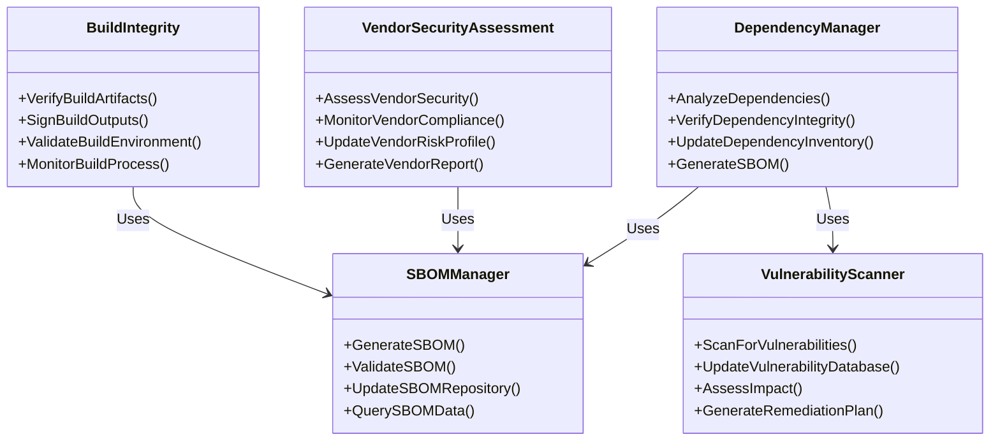
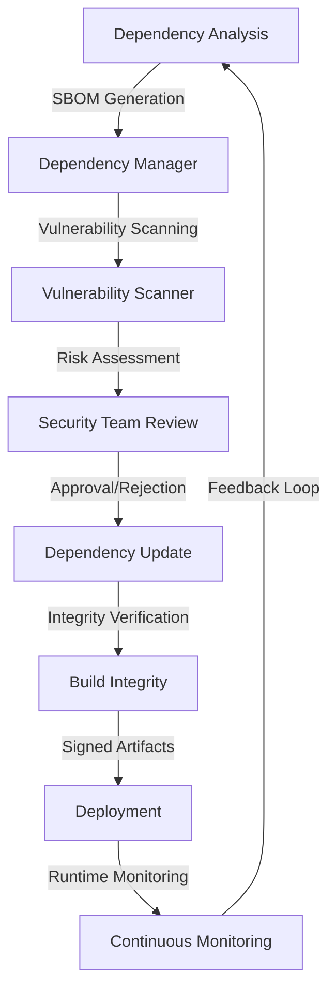

# Supply Chain Security

## Overview

This document provides comprehensive documentation for the Supply Chain Security measures implemented in the SilentRelay application. Supply chain security focuses on protecting the integrity of all dependencies, third-party components, and development processes.

## Architecture

### Supply Chain Security Components



### Supply Chain Security Flow



## Implementation Details

### Dependency Management

#### Dependency Analysis

```go
// DependencyAnalyzer examines project dependencies for security risks
type DependencyAnalyzer struct {
    projectPath    string
    lockFileParser  LockFileParser
    vulnerabilityDB *VulnerabilityDatabase
    sbomGenerator   *SBOMGenerator
    metrics         *DependencyMetrics
}

// AnalyzeDependencies performs comprehensive dependency analysis
func (da *DependencyAnalyzer) AnalyzeDependencies() (*DependencyAnalysisReport, error) {
    // Parse dependency lock files
    dependencies, err := da.parseLockFiles()
    if err != nil {
        return nil, fmt.Errorf("failed to parse lock files: %w", err)
    }

    // Generate SBOM
    sbom, err := da.sbomGenerator.GenerateSBOM(dependencies)
    if err != nil {
        return nil, fmt.Errorf("failed to generate SBOM: %w", err)
    }

    // Scan for vulnerabilities
    vulnerabilities := da.scanForVulnerabilities(dependencies)

    // Assess dependency risks
    riskAssessment := da.assessDependencyRisks(dependencies, vulnerabilities)

    // Generate report
    report := &DependencyAnalysisReport{
        Dependencies:     dependencies,
        SBOM:              sbom,
        Vulnerabilities:   vulnerabilities,
        RiskAssessment:    riskAssessment,
        GeneratedAt:       time.Now(),
        AnalysisVersion:  "v1.2.0",
    }

    return report, nil
}

// parseLockFiles extracts dependency information from lock files
func (da *DependencyAnalyzer) parseLockFiles() ([]*Dependency, error) {
    var dependencies []*Dependency

    // Parse Go modules
    goDeps, err := da.lockFileParser.ParseGoMod(da.projectPath + "/go.mod")
    if err != nil {
        return nil, fmt.Errorf("failed to parse go.mod: %w", err)
    }
    dependencies = append(dependencies, goDeps...)

    // Parse npm packages (if applicable)
    if _, err := os.Stat(da.projectPath + "/package.json"); err == nil {
        npmDeps, err := da.lockFileParser.ParsePackageLock(da.projectPath + "/package-lock.json")
        if err != nil {
            return nil, fmt.Errorf("failed to parse package-lock.json: %w", err)
        }
        dependencies = append(dependencies, npmDeps...)
    }

    return dependencies, nil
}
```

### SBOM Generation

```go
// SBOMGenerator creates Software Bill of Materials documents
type SBOMGenerator struct {
    projectInfo    *ProjectInformation
    outputFormat   string
    validationRules *SBOMValidationRules
}

// GenerateSBOM creates a comprehensive Software Bill of Materials
func (sg *SBOMGenerator) GenerateSBOM(dependencies []*Dependency) (*SBOM, error) {
    // Create SBOM structure
    sbom := &SBOM{
        SPDXID:         "SPDXRef-DOCUMENT",
        Name:           sg.projectInfo.Name,
        Version:        sg.projectInfo.Version,
        CreationInfo: &CreationInfo{
            Created: time.Now().Format(time.RFC3339),
            Creators: []string{
                "Tool: secure-messenger-sbom-generator",
                "Organization: SecureMessenger",
            },
        },
        Packages: make([]*Package, 0),
        Relationships: make([]*Relationship, 0),
    }

    // Add project package
    projectPackage := sg.createProjectPackage()
    sbom.Packages = append(sbom.Packages, projectPackage)

    // Add dependency packages
    for _, dep := range dependencies {
        pkg := sg.createDependencyPackage(dep)
        sbom.Packages = append(sbom.Packages, pkg)

        // Add relationship
        rel := &Relationship{
            RefA:         projectPackage.PackageSPDXIdentifier,
            RefB:         pkg.PackageSPDXIdentifier,
            Relationship: "DEPENDS_ON",
        }
        sbom.Relationships = append(sbom.Relationships, rel)
    }

    // Validate SBOM
    if err := sg.validateSBOM(sbom); err != nil {
        return nil, fmt.Errorf("SBOM validation failed: %w", err)
    }

    return sbom, nil
}

// createDependencyPackage converts a dependency to SBOM package format
func (sg *SBOMGenerator) createDependencyPackage(dep *Dependency) *Package {
    return &Package{
        PackageName:              dep.Name,
        PackageVersion:           dep.Version,
        PackageSPDXIdentifier:    "SPDXRef-Package-" + dep.Name + "-" + dep.Version,
        PackageDownloadLocation:  dep.Repository,
        FilesAnalyzed:            false,
        PackageVerificationCode: dep.Checksum,
        PackageLicenseConcluded: dep.License,
        PackageLicenseDeclared: dep.License,
        ExternalRefs: []*ExternalRef{
            {
                ReferenceCategory: "PACKAGE-MANAGER",
                ReferenceType:     "purl",
                ReferenceLocator:  "pkg:" + dep.Ecosystem + "/" + dep.Name + "@" + dep.Version,
            },
        },
    }
}
```

### Vendor Security Assessment

```go
// VendorSecurityAssessor evaluates third-party vendor security
type VendorSecurityAssessor struct {
    assessmentTemplates map[string]*AssessmentTemplate
    vendorDatabase      *VendorDatabase
    riskScoringModel    *RiskScoringModel
    complianceChecker   *ComplianceChecker
}

// AssessVendorSecurity performs comprehensive vendor security assessment
func (vsa *VendorSecurityAssessor) AssessVendorSecurity(vendorID string) (*VendorSecurityReport, error) {
    // Retrieve vendor information
    vendor, err := vsa.vendorDatabase.GetVendor(vendorID)
    if err != nil {
        return nil, fmt.Errorf("failed to retrieve vendor: %w", err)
    }

    // Perform security questionnaire assessment
    questionnaireResult, err := vsa.performQuestionnaireAssessment(vendor)
    if err != nil {
        return nil, fmt.Errorf("questionnaire assessment failed: %w", err)
    }

    // Conduct technical security review
    technicalReview, err := vsa.performTechnicalReview(vendor)
    if err != nil {
        return nil, fmt.Errorf("technical review failed: %w", err)
    }

    // Check compliance with standards
    complianceResult := vsa.complianceChecker.CheckCompliance(vendor, []string{
        "iso-27001", "soc-2", "gdpr", "hipaa",
    })

    // Calculate overall risk score
    riskScore := vsa.riskScoringModel.CalculateRiskScore(
        questionnaireResult, technicalReview, complianceResult)

    // Generate report
    report := &VendorSecurityReport{
        VendorID:            vendorID,
        VendorName:          vendor.Name,
        AssessmentDate:      time.Now(),
        QuestionnaireResult: questionnaireResult,
        TechnicalReview:     technicalReview,
        ComplianceResult:    complianceResult,
        RiskScore:           riskScore,
        RiskLevel:           calculateRiskLevel(riskScore),
        Recommendations:     vsa.generateRecommendations(riskScore, vendor),
    }

    return report, nil
}
```

## Security Measures

### Dependency Security

1. **Dependency Verification**
   - Cryptographic checksum validation
   - Source repository verification
   - Build reproducibility checks

2. **Vulnerability Management**
   - Continuous vulnerability scanning
   - Automated patch management
   - Risk-based prioritization

3. **Update Process**
   - Secure update mechanisms
   - Rollback capabilities
   - Change impact analysis

### Build Integrity

```go
// BuildIntegrityVerifier ensures build process security
type BuildIntegrityVerifier struct {
    buildEnvironment *SecureBuildEnvironment
    signingKeys      *KeyManager
    artifactRepository *ArtifactRepository
}

// VerifyBuildIntegrity validates the build process and outputs
func (biv *BuildIntegrityVerifier) VerifyBuildIntegrity(buildID string) (*BuildVerificationReport, error) {
    // Retrieve build information
    buildInfo, err := biv.artifactRepository.GetBuildInfo(buildID)
    if err != nil {
        return nil, fmt.Errorf("failed to retrieve build info: %w", err)
    }

    // Verify build environment
    envStatus, err := biv.verifyBuildEnvironment(buildInfo.EnvironmentID)
    if err != nil {
        return nil, fmt.Errorf("build environment verification failed: %w", err)
    }

    // Validate build artifacts
    artifactStatus, err := biv.validateBuildArtifacts(buildInfo.Artifacts)
    if err != nil {
        return nil, fmt.Errorf("artifact validation failed: %w", err)
    }

    // Verify cryptographic signatures
    signatureStatus, err := biv.verifyArtifactSignatures(buildInfo.Artifacts)
    if err != nil {
        return nil, fmt.Errorf("signature verification failed: %w", err)
    }

    // Generate verification report
    report := &BuildVerificationReport{
        BuildID:             buildID,
        VerificationTime:    time.Now(),
        EnvironmentStatus:  envStatus,
        ArtifactStatus:      artifactStatus,
        SignatureStatus:     signatureStatus,
        OverallStatus:       calculateOverallStatus(envStatus, artifactStatus, signatureStatus),
        Recommendations:    biv.generateRecommendations(buildInfo),
    }

    return report, nil
}

// verifyBuildArtifacts validates build output integrity
func (biv *BuildIntegrityVerifier) verifyBuildArtifacts(artifacts []*BuildArtifact) (*ArtifactValidationStatus, error) {
    status := &ArtifactValidationStatus{
        TotalArtifacts: len(artifacts),
        ValidArtifacts: 0,
        InvalidArtifacts: 0,
        Details: make(map[string]*ArtifactValidationDetail),
    }

    for _, artifact := range artifacts {
        detail := &ArtifactValidationDetail{
            ArtifactID: artifact.ID,
            Checks: make(map[string]bool),
        }

        // Check artifact existence
        exists, err := biv.artifactRepository.ArtifactExists(artifact.ID)
        if err != nil || !exists {
            detail.Checks["existence"] = false
            status.InvalidArtifacts++
            status.Details[artifact.ID] = detail
            continue
        }
        detail.Checks["existence"] = true

        // Verify artifact checksum
        if biv.verifyArtifactChecksum(artifact) {
            detail.Checks["checksum"] = true
        } else {
            detail.Checks["checksum"] = false
            status.InvalidArtifacts++
        }

        // Validate artifact size
        if biv.validateArtifactSize(artifact) {
            detail.Checks["size"] = true
        } else {
            detail.Checks["size"] = false
            status.InvalidArtifacts++
        }

        status.Details[artifact.ID] = detail
        if detail.IsValid() {
            status.ValidArtifacts++
        } else {
            status.InvalidArtifacts++
        }
    }

    return status, nil
}
```

## Compliance Requirements

### Standards Compliance Matrix

| Standard | Requirement | Implementation | Compliance Status |
|----------|-------------|----------------|-------------------|
| NIST SP 800-161 | Supply chain risk management | Vendor assessments, dependency analysis | [x] Compliant |
| ISO 27001 | Supplier relationships | Vendor security assessments | [x] Compliant |
| SOC 2 | Vendor management | Comprehensive vendor security reviews | [x] Compliant |
| GDPR | Data processor security | Third-party security validation | [x] Compliant |
| CIS Controls | Inventory and control of software assets | SBOM generation and management | [x] Compliant |

### Audit Requirements

1. **Dependency Audit**
   - Complete dependency inventory
   - Vulnerability assessment records
   - Patch management verification

2. **Vendor Audit**
   - Vendor security assessment reports
   - Contractual security requirements
   - Compliance verification

3. **Build Process Audit**
   - Build environment security
   - Artifact signing verification
   - Reproducibility validation

## Testing and Validation

### Test Coverage

```go
// TestSupplyChainSecurity tests the complete supply chain security process
func TestSupplyChainSecurity(t *testing.T) {
    // Setup test environment
    scs, cleanup := setupTestSupplyChainSecurity()
    defer cleanup()

    // Test dependency analysis
    t.Run("DependencyAnalysis", func(t *testing.T) {
        // Analyze test dependencies
        report, err := scs.dependencyAnalyzer.AnalyzeDependencies()
        require.NoError(t, err)
        assert.NotNil(t, report)
        assert.True(t, len(report.Dependencies) > 0)
        assert.NotNil(t, report.SBOM)
    })

    // Test SBOM generation
    t.Run("SBOMGeneration", func(t *testing.T) {
        // Generate SBOM
        sbom, err := scs.sbomGenerator.GenerateSBOM([]*Dependency{
            createTestDependency("github.com/test/dep1", "v1.0.0"),
            createTestDependency("github.com/test/dep2", "v2.0.0"),
        })
        require.NoError(t, err)
        assert.NotNil(t, sbom)
        assert.Equal(t, 3, len(sbom.Packages)) // 1 project + 2 deps
        assert.True(t, len(sbom.Relationships) > 0)
    })

    // Test vulnerability scanning
    t.Run("VulnerabilityScanning", func(t *testing.T) {
        // Scan test dependencies
        vulnerabilities := scs.vulnerabilityScanner.ScanForVulnerabilities([]*Dependency{
            createVulnerableDependency("github.com/vulnerable/dep", "v1.0.0"),
        })

        assert.True(t, len(vulnerabilities) > 0)
        assert.True(t, vulnerabilities[0].Severity == SeverityHigh ||
                   vulnerabilities[0].Severity == SeverityCritical)
    })

    // Test vendor assessment
    t.Run("VendorAssessment", func(t *testing.T) {
        // Assess test vendor
        report, err := scs.vendorAssessor.AssessVendorSecurity("test-vendor-1")
        require.NoError(t, err)
        assert.NotNil(t, report)
        assert.True(t, report.RiskScore >= 0 && report.RiskScore <= 100)
    })
}
```

### Validation Procedures

1. **Dependency Validation**
   - SBOM accuracy verification
   - Vulnerability scan validation
   - Update process testing

2. **Vendor Validation**
   - Assessment process verification
   - Risk scoring validation
   - Compliance checking

3. **Build Validation**
   - Environment security testing
   - Artifact verification
   - Signature validation

## Deployment and Monitoring

### Deployment Checklist

- [ ] Dependency analysis infrastructure
- [ ] SBOM generation and management
- [ ] Vulnerability scanning system
- [ ] Vendor assessment processes
- [ ] Build integrity verification
- [ ] Continuous monitoring setup
- [ ] Alerting and reporting

### Monitoring Requirements

| Metric | Threshold | Alert Level | Response |
|--------|-----------|-------------|----------|
| New vulnerabilities | > 5 critical | High | Immediate patching |
| Vendor risk increase | > 20% | Medium | Vendor review |
| Build failures | > 0.5% | Medium | Build process review |
| SBOM generation failures | > 0 | High | System check |
| Dependency update delays | > 7 days | Medium | Update process review |

## Incident Response Procedures

### Supply Chain Incident Scenarios

1. **Dependency Vulnerability Discovery**
   - Immediate vulnerability assessment
   - Impact analysis
   - Patch or mitigation deployment
   - Vendor notification

2. **Vendor Security Breach**
   - Vendor relationship review
   - Alternative sourcing
   - Contractual remedy execution
   - User notification (if applicable)

3. **Build System Compromise**
   - Build environment isolation
   - Artifact validation
   - System rebuild from clean state
   - Forensic analysis

## Future Enhancements

### Planned Supply Chain Security Improvements

| Enhancement | Target Date | Description |
|-------------|-------------|-------------|
| Automated SBOM Updates | Q1 2026 | Real-time SBOM generation |
| AI Vulnerability Prediction | Q2 2026 | Predictive vulnerability analysis |
| Blockchain-Based Verification | Q3 2026 | Immutable build verification |
| Automated Vendor Monitoring | Q1 2026 | Continuous vendor security monitoring |
| Quantum-Resistant Signing | Q4 2026 | Post-quantum cryptographic signatures |

## Conclusion

The Supply Chain Security implementation provides comprehensive protection for all dependencies, third-party components, and build processes in the SilentRelay application. This documentation covers all aspects of supply chain security from dependency analysis to build integrity verification.

**Key Capabilities:**
- Comprehensive dependency analysis and SBOM generation
- Vendor security assessment and monitoring
- Build process integrity verification
- Continuous vulnerability management

**Security Impact:**
- Reduced supply chain attack surface
- Enhanced third-party security validation
- Improved build process trustworthiness
- Comprehensive supply chain risk management

**Future Directions:**
- Automated supply chain security monitoring
- AI-powered vulnerability prediction
- Blockchain-based verification systems
- Continuous supply chain security improvement

**Last Updated:** 2025-12-04
**Next Review:** 2026-01-15
**Maintainer:** Security Team